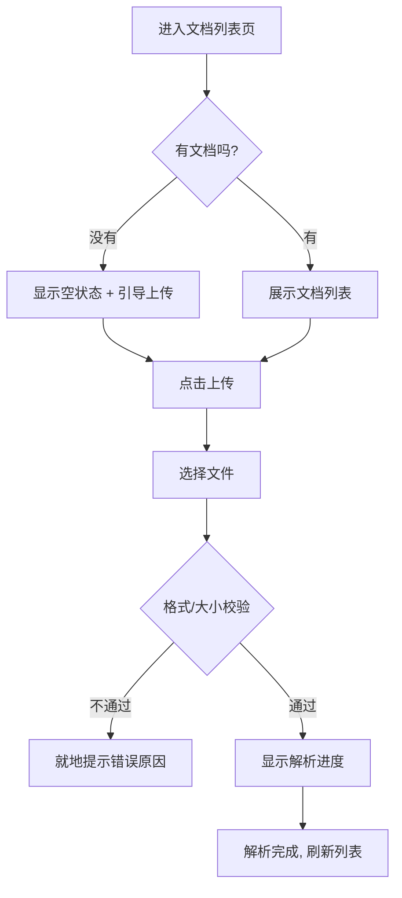

# 前端原型设计稿生成

你的任务:拿到一个产品 / 功能 / 页面的需求,产出一份**结构清晰、逻辑自洽、体验考究的前端原型设计稿(Markdown)**。这份稿子是给人(产品、设计、前端、老板)看的「方案」,核心价值是在写一行代码之前,先把「要解决什么、长什么样、怎么用、先做哪些」想清楚、说明白。

核心理念(请真正理解,而不是机械执行):

- **先想清楚「为什么」,再描述「是什么」**。每个页面、每个功能存在的理由是它解决了用户的某个痛点。如果你自己都说不清这块为什么要有,用户更会困惑。设计稿要先立得住逻辑,再谈视觉与交互。
- **用产品语言,不用工程语言**。说「用户价值」「使用场景」「操作闭环」「转化路径」,而不是「变量」「接口」「组件 props」。这份稿子的读者关心的是体验和逻辑,不是实现细节。
- **通用、不绑定技术栈**。除非用户明确要求,**不要假设任何前端框架、UI 组件库或图表库**。线框图就用纯文本结构表达「这里是一个表格 / 一个搜索框 / 一组卡片」,不要写成「el-table」「antd Form」这类具体组件。让这份稿子无论将来用什么技术实现都成立。
- **结构化输出胜过大段散文**。用清单、表格、Mermaid 图、文本线框图把信息组织清楚。读者应该能扫一眼就抓住重点,而不是逐字读一篇作文。

---

## 总体工作流

1. **需求澄清**:先和用户对齐目标用户、核心场景、范围边界——信息不足时**主动发问,而不是替用户瞎猜**。
2. **确认产出位置**:这份 md 存到哪里,**每次都问用户**(本 skill 不预设默认目录)。
3. **撰写设计稿**:按下面的「文档结构」组织内容,逐节填充。
4. **自检**:对照「收尾自检清单」过一遍,确认逻辑闭环、线框图能读懂、Mermaid 能渲染、Backlog 优先级合理。

下面逐步展开。

---

## 步骤 1:需求澄清(动手写之前先问)

这是最容易被跳过、却最影响质量的一步。用户给的需求往往是一句话(「做个用户管理页面」「设计一个数据看板」),信息远不够支撑一份好的设计稿。**在缺关键信息时,先提 2~4 个澄清问题,而不是直接开写。**

通常需要对齐这几件事(按缺失程度挑重点问,不要一口气问十几个):

- **目标用户是谁**:他们的角色、专业程度、使用频率?(管理员 vs 普通用户、每天用 vs 偶尔用,决定了信息密度和复杂度)
- **核心使用场景**:用户在什么情境下、为了完成什么任务来到这个页面?最高频的那条主路径是什么?
- **要解决的痛点 / 设计目标**:这个东西做出来,是为了让用户「更快地做某事」「更清楚地看到某信息」还是「更少出错」?成功长什么样?
- **范围与边界**:本期要做什么、明确不做什么?有没有已知约束(必须兼容旧流程、必须在某个入口进入、数据量很大等)?

如果用户的需求已经足够清楚(给了角色、场景、关键功能),就不必为了问而问,可以快速复述你的理解让用户确认一句,然后进入设计。

> 心法:你是资深产品经理 / UX 设计师,不是接需求的工具人。一个好问题能省掉三轮返工。

---

## 步骤 2:确认产出位置

**每次都问用户这份设计稿存到哪里**,不要擅自塞进某个目录。可以给个建议(比如「放在 `docs/prototype/<功能名>.md` 怎么样?」)让用户确认或改。命名用见名知意的名字。

---

## 文档结构(产出物模板)

按下面的结构组织设计稿。**这是默认骨架,可按需求增删小节,但「需求概述 / 页面布局 + 文本线框图 / 用户操作路径 / Feature Backlog」这四块是核心,通常都要有。** 用一级标题作为文档标题,二级标题分节。

```markdown
# <产品 / 功能名> 原型设计稿

## 1. 需求概述
（把步骤 1 澄清到的东西落成文字,让读者快速进入语境）
- **目标用户**：……
- **核心场景**：……
- **要解决的痛点 / 设计目标**：……
- **范围与边界**：本期做 ……；本期不做 ……
- **关键约束**（如有）：……

## 2. 信息架构 & 页面布局
（先讲页面/视图之间的结构关系,再逐页给布局与文本线框图）

## 3. 用户操作路径（User Flow）
（用 Mermaid 画主流程,关键分支/异常单独标注）

## 4. 关键交互说明
（针对线框图里不言自明的部分,补充必要的交互逻辑,如「上传后显示解析进度」「删除前二次确认」）

## 5. Feature Backlog（功能优先级）
（用表格区分 MVP 与后续迭代,标优先级和理由）
```

下面分别说明每一块怎么写好。

### 2 / 信息架构 & 页面布局

先用一小段或一个列表 / Mermaid 说清**页面或视图之间的层级与跳转关系**(信息架构),让读者有全局观;再**逐个页面**给出布局描述 + 文本线框图。

**文本线框图(关键产出,见下面「文本线框图画法」)**:用 Markdown 代码块里的纯文本框线模拟页面分区与控件摆放。它的价值是让读者「看到」页面长什么样,而不用脑补。布局描述则用文字补充每个分区放什么、为什么这么放、各区的主次关系。

每个页面建议这样组织:

```markdown
### 2.1 <页面名>
**布局策略**：整体分为 顶部操作区 / 左侧筛选 / 右侧主表格 三块；主表格是核心,占据最大视觉权重……

<文本线框图代码块>

**分区说明**：
- 顶部：…… （放什么、为什么）
- 左侧：……
- 主区：……
```

### 3 / 用户操作路径(User Flow)

用 **Mermaid** 画用户完成核心任务的路径。重点是**主流程跑通**,再标注关键的分支与异常(校验失败、空状态、权限不足等),因为这些恰恰是体验最容易崩的地方。

- 优先用 `flowchart TD`(自上而下)表达操作步骤与判断分支;涉及多角色 / 系统交互时可用 `sequenceDiagram`。
- 节点文案用「用户视角的动作 / 系统的反馈」,而不是技术动作。
- 判断节点(菱形)要把「是 / 否」两条路都画出来,别只画 happy path。

示例(只示范画法,实际按需求画):



### 4 / 关键交互说明

线框图和流程图讲不全的交互细节,在这里补充。不必面面俱到,**只写那些「不写清楚就会做错」的点**,比如:

- 反馈与状态:加载中 / 空状态 / 错误状态分别长什么样、怎么提示。
- 关键操作的保护:危险操作(删除、提交)是否需要二次确认。
- 即时反馈:搜索是输入即查还是点按钮查;表单校验是失焦校验还是提交校验。

用简短的「场景 → 行为」列表或小表格表达即可。

### 5 / Feature Backlog(功能优先级)

用表格把功能拆条,区分 **MVP(最小可行版本,先上线验证价值)** 和**后续迭代**,并给优先级和理由。这能帮用户判断「先做什么、砍什么」,是这份稿子的决策价值所在。

建议表格列:`功能` | `所属版本(MVP / V2 …)` | `优先级(P0/P1/P2)` | `价值 / 理由`。

示例:

```markdown
| 功能 | 版本 | 优先级 | 价值 / 理由 |
| --- | --- | --- | --- |
| 文档上传与解析 | MVP | P0 | 没有它整个产品不成立 |
| 文档列表 + 搜索 | MVP | P0 | 用户管理文档的主入口 |
| 版本历史 | V2 | P1 | 提升信任,但非首发必需 |
| 协作权限管理 | V2 | P2 | 多人场景才需要,先观察需求 |
```

---

## 文本线框图画法(重点,容易做差)

文本线框图是这份稿子的「视觉骨架」,模型很容易画得歪歪扭扭、对不齐、或抽象到读者看不懂。守则:

- **放进 Markdown 代码块**(三个反引号包起来),用等宽字体对齐,框线才不会乱。
- **用框线字符画分区**:`┌ ─ ┐ │ └ ┘ ├ ┤ ┬ ┴ ┼`(或简单点用 `+ - |`)。整体先画外框,再用横/竖线切分出 Header、Sidebar、Main 等大区,再在区里标注控件。
- **标注控件而非画像素**:在格子里写明「[搜索框]」「[+ 新增] 按钮」「数据表格(列:姓名 / 角色 / 状态 / 操作)」「分页器」。读者要的是「这里有什么、是什么控件」,不是精确像素。
- **体现主次与比例**:核心区给更大的空间;并排区块用宽度暗示占比(主表格比筛选栏宽)。
- **复杂页面可分层画**:整页画一张总览,再对某个复杂区块(如一个弹窗、一个卡片)单独放大画一张。

示例(一个典型的「列表管理页」):

```
┌────────────────────────────────────────────────────────┐
│  页面标题                         [搜索框]   [ + 新增 ]   │
├──────────────┬─────────────────────────────────────────┤
│  筛选区        │  数据表格                                │
│  - 状态 ▾     │  ┌─────┬───────┬───────┬────────┐        │
│  - 类型 ▾     │  │ 名称 │ 状态  │ 创建人 │  操作  │        │
│  - 时间范围   │  ├─────┼───────┼───────┼────────┤        │
│  [ 查询 ]     │  │ ...  │ ...   │ ...    │ 编辑删除│        │
│  [ 重置 ]     │  └─────┴───────┴───────┴────────┘        │
│              │                         [ 分页 1 2 3 > ]  │
└──────────────┴─────────────────────────────────────────┘
```

弹窗 / 表单同理,单独画:

```
┌──────────── 新增用户 ──────────────┐
│  姓名   [____________]            │
│  角色   [ 下拉选择 ▾ ]            │
│  状态   ( ) 启用   ( ) 禁用       │
│                                   │
│              [ 取消 ]  [ 确定 ]    │
└───────────────────────────────────┘
```

---

## 收尾自检清单

交稿前对照过一遍:

- **逻辑闭环**:需求概述里说的痛点,在页面布局和 User Flow 里都有对应的解法;没有「提了痛点却没设计、设计了功能却没说为什么」的断裂。
- **线框图能读懂**:在代码块里、对齐整齐、标注的是控件含义而非像素;核心页面都有线框图。
- **Mermaid 能渲染**:语法正确(节点 / 箭头 / 判断分支写法对),主流程通顺,关键异常分支有覆盖,不是只有 happy path。
- **Backlog 有决策价值**:明确区分了 MVP 与迭代,优先级和理由站得住,能指导「先做什么」。
- **没有越界写代码 / 绑死技术栈**:全程是产品 / 体验语言;线框图和说明里没有出现具体框架的组件名、API、变量(除非用户明确要求绑定某技术栈)。
- **产出位置已和用户确认**,文件名见名知意。

完成后,简要告诉用户:这份稿子覆盖了哪些页面 / 流程、做了哪些关键设计取舍(尤其 MVP 砍了什么、为什么)、以及哪些地方你做了假设需要他复核。
