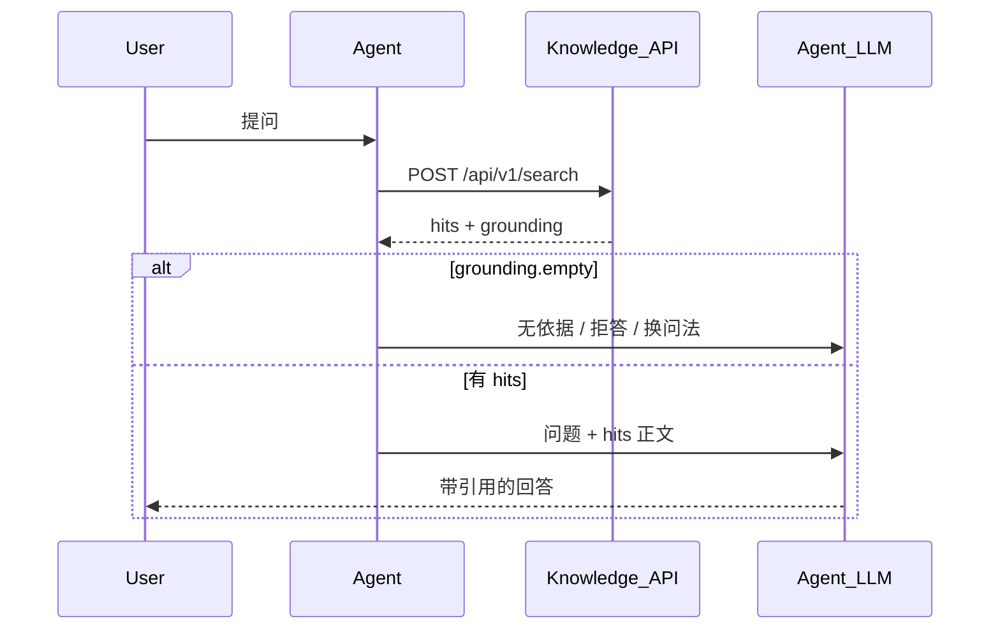

# Agent 接入指南 — Knowledge 服务

面向将 `@monai-ragsdk/knowledge` 作为 **knowledge tool** 的 Agent / 编排层开发者。

服务定位：**只检索、不生成**。Agent 自己根据返回的 `hits[].content` 组织答案，并引用 `sourceId` / `title`。

---

## 1. 接入模型



推荐只暴露 **一个主 tool**：`knowledge_search`（对应 `POST /api/v1/search`）。

可选辅助：

- 启动时或会话初：`GET /api/v1/collections`，把库列表写进 system prompt，便于 Agent 选择 `collectionIds`
- 探活：`GET /health`

**不要**把本服务当成问答 API（无 `ask`）；生成与拒答策略由 Agent 侧 LLM 负责。

---

## 2. 基础约定

| 项 | 值 |
| --- | --- |
| 默认基址 | `http://localhost:3001` |
| API 前缀 | `/api/v1` |
| 健康检查 | `GET /health`（不在 `/api/v1` 下） |
| 请求体 | `Content-Type: application/json; charset=utf-8` |
| 响应体 | JSON，UTF-8 |
| 错误体 | `{ "message": string, "code"?: string }` |

常见 HTTP 状态：`200`；参数错误 `400`；库不存在 `404`；未捕获异常 `500`（`code: internal_error`）。

当前**无认证**。生产环境请在网关加 API Key / mTLS，并按 `collectionIds` 做库级授权。

---

## 3. API 参考

### 3.1 `GET /health`

探活与依赖配置是否就绪（不 ping 远端模型）。

**响应 `200`**

```json
{
  "ok": true,
  "embedding": "connected",
  "vectorStore": "connected"
}
```

`embedding` / `vectorStore` 取值：`connected` | `unconfigured`。

---

### 3.2 `GET /api/v1/collections`

列出控制台已登记、可检索的知识库（只读）。

**响应 `200`**：`KnowledgeCollectionSummary[]`

```json
[
  {
    "id": "kb-1e80b748-a66e-4aea-a438-4098a551aa10",
    "name": "产品手册库",
    "description": "内部产品文档",
    "documentCount": 12
  }
]
```

| 字段 | 说明 |
| --- | --- |
| `id` | 传给 `search` 的 `collectionIds` |
| `documentCount` | 非 `failed` 状态的文档数；`0` 时检索可能无命中 |

---

### 3.3 `POST /api/v1/search`（主接口）

retrieve-only：跑 pre-retrieval → retrieval → post-retrieval，**不调用生成 LLM**。

#### 请求

```json
{
  "query": "什么是知识库？",
  "collectionIds": ["kb-1e80b748-a66e-4aea-a438-4098a551aa10"],
  "topK": 8
}
```

| 字段 | 必填 | 说明 |
| --- | --- | --- |
| `query` | 是 | 用户问题或检索意图 |
| `collectionIds` | 否 | 限定候选库；省略 = 全部已登记库 |
| `topK` | 否 | 返回条数上限；省略 = 控制台全局策略 `retrieval.topK`（默认 8） |

#### 响应 `200`

```json
{
  "query": "什么是知识库？",
  "effectiveQuery": "知识库的定义",
  "traceId": "9f80ca91-fa6e-4379-a709-20118c6e9af2",
  "hits": [
    {
      "rank": 1,
      "collectionId": "kb-1e80b748-a66e-4aea-a438-4098a551aa10",
      "sourceId": "rag-intro.md",
      "title": "RAG 入门",
      "content": "知识库是……（完整 chunk 正文，非摘要）",
      "score": 0.12,
      "scoreKind": "rrf"
    }
  ],
  "grounding": {
    "empty": false
  }
}
```

| 字段 | 说明 |
| --- | --- |
| `query` | 原始请求问题 |
| `effectiveQuery` | 经 query rewrite 等策略后的检索用 query；与 `query` 相同时省略 |
| `traceId` | 本次检索 trace，便于与日志对齐 |
| `hits[].content` | **完整正文**，可直接拼进 Agent prompt |
| `hits[].sourceId` | 引用键；回答中应标注来源 |
| `hits[].score` | 相对分数，跨请求不可比 |
| `hits[].scoreKind` | 可选：`retriever` \| `rrf` \| `llm` |
| `grounding.empty` | `true` 表示无可用依据 |
| `grounding.chunksEmptyReason` | 仅 `empty=true` 时：`no-hits` \| `filtered` \| `skipped` |

#### `grounding` 语义（Agent 决策）

| `chunksEmptyReason` | 含义 | Agent 建议 |
| --- | --- | --- |
| `no-hits` | 检索 0 条 | 告知无相关资料，勿编造 |
| `filtered` | 有召回但被后处理滤光 | 可换问法或放宽 scope |
| `skipped` | 检索被主动跳过（如 routing skip） | 检查是否应指定 `collectionIds` 或调整策略 |

---

## 4. Tool 定义（OpenAI / 通用 function calling）

### 4.1 `knowledge_search`

```json
{
  "type": "function",
  "function": {
    "name": "knowledge_search",
    "description": "从企业知识库检索与问题相关的文档片段。返回完整正文与 sourceId，用于作答时引用。无命中时 grounding.empty 为 true。",
    "parameters": {
      "type": "object",
      "properties": {
        "query": {
          "type": "string",
          "description": "检索用自然语言问题，尽量具体"
        },
        "collection_ids": {
          "type": "array",
          "items": { "type": "string" },
          "description": "可选。限定知识库 id（kb- 开头）。已知领域时建议传入以提高准确率"
        },
        "top_k": {
          "type": "integer",
          "minimum": 1,
          "maximum": 20,
          "description": "可选。最多返回几条片段，默认 8"
        }
      },
      "required": ["query"]
    }
  }
}
```

**参数映射**（tool → HTTP）：

| Tool 参数 | HTTP 字段 |
| --- | --- |
| `query` | `query` |
| `collection_ids` | `collectionIds` |
| `top_k` | `topK` |

### 4.2 `list_knowledge_collections`（可选）

```json
{
  "type": "function",
  "function": {
    "name": "list_knowledge_collections",
    "description": "列出当前可检索的知识库 id、名称与文档数量",
    "parameters": {
      "type": "object",
      "properties": {}
    }
  }
}
```

实现：对 `GET /api/v1/collections` 发请求。

---

## 5. Agent System Prompt 片段（示例）

```text
你可以使用 knowledge_search 查询企业知识库。

规则：
1. 回答事实类问题前，必须先调用 knowledge_search。
2. 只根据 hits[].content 作答；不要编造 hits 中不存在的信息。
3. 引用时标注 sourceId 或 title，例如 [rag-intro.md]。
4. 若 grounding.empty 为 true，明确说明知识库中未找到依据，不要猜测。
5. 已知问题属于某一知识库时，传入 collection_ids 以提高准确率。
```

---

## 6. 调用示例

### 6.1 curl（Windows 请用 `curl.exe`）

```bash
curl.exe -X POST "http://localhost:3001/api/v1/search" ^
  -H "Content-Type: application/json; charset=utf-8" ^
  -d "{\"query\":\"什么是知识库？\",\"collectionIds\":[\"kb-xxx\"]}"
```

### 6.2 PowerShell（须 UTF-8）

```powershell
$body = @{
  query = '什么是知识库？'
  collectionIds = @('kb-1e80b748-a66e-4aea-a438-4098a551aa10')
  topK = 5
} | ConvertTo-Json -Compress

Invoke-RestMethod `
  -Uri 'http://localhost:3001/api/v1/search' `
  -Method POST `
  -ContentType 'application/json; charset=utf-8' `
  -Body ([System.Text.Encoding]::UTF8.GetBytes($body))
```

> PowerShell 5.1 直接 `-Body '{"query":"中文"}'` 可能把中文打成乱码，导致 rewrite 策略异常。务必用 UTF-8 字节或 `curl.exe`。

### 6.3 TypeScript

```typescript
const BASE = 'http://localhost:3001/api/v1';

export async function knowledgeSearch(input: {
  query: string;
  collectionIds?: string[];
  topK?: number;
}) {
  const res = await fetch(`${BASE}/search`, {
    method: 'POST',
    headers: { 'Content-Type': 'application/json; charset=utf-8' },
    body: JSON.stringify({
      query: input.query,
      collectionIds: input.collectionIds,
      topK: input.topK,
    }),
  });

  if (!res.ok) {
    const err = (await res.json()) as { message?: string };
    throw new Error(err.message ?? `search failed: ${res.status}`);
  }

  return res.json();
}
```

### 6.4 Python

```python
import requests

BASE = "http://localhost:3001/api/v1"

def knowledge_search(query: str, collection_ids: list[str] | None = None, top_k: int | None = None):
    payload = {"query": query}
    if collection_ids:
        payload["collectionIds"] = collection_ids
    if top_k is not None:
        payload["topK"] = top_k

    r = requests.post(f"{BASE}/search", json=payload, timeout=60)
    r.raise_for_status()
    return r.json()
```

---

## 7. `collectionIds` 与自动选库

两层语义不要混用：

| 层 | 谁控制 | 作用 |
| --- | --- | --- |
| API `collectionIds` | Agent / 调用方 | 限定**候选**知识库 |
| 内核 `routeDecision.targets` | 控制台全局策略里的 **query routing** | 从候选中**实际检索**哪些库 |

默认策略（`balanced`）**未开启 routing**。此时：

- 不传 `collectionIds`：多库时 FanOut 往往只打**第一个**库
- **已知领域时建议显式传 `collectionIds`**

若控制台开启了 `preRetrieval.routing`，可不传 `collectionIds`（候选=全部库），由 routing LLM 选库；需配置 `DOTSAI_*` chat key。

检索流水线（rewrite、rerank、阈值等）由控制台**全局策略**决定，本 API **不支持** per-request 改策略。

---

## 8. 错误与重试

| HTTP | `code` | 场景 | Agent 处理 |
| --- | --- | --- | --- |
| 400 | `bad_request` | `query` 为空、无可用库 | 提示用户换问法或联系管理员 |
| 404 | `not_found` | `collectionIds` 中 id 不存在 | 重新 `list collections` 后重试 |
| 500 | `internal_error` | 服务异常、模型 key 缺失等 | 有限次重试；失败则降级说明 |

检索超时建议：客户端 **60s**（默认策略含多次 LLM：rewrite / rerank / compression）。

---

## 9. 边界（刻意不提供）

| 能力 | 说明 |
| --- | --- |
| `POST /ask` | 无；由 Agent LLM 生成答案 |
| 入库 / 删文档 | 走控制台 `apps/server` |
| 改检索策略 | 走控制台「装配」页全局策略 |
| pipeline / observer | 不返回；需要调试请用控制台 `/search` 或观测页 |
| 认证 / 多租户 | 未实现；自行在网关层补足 |

---

## 10. 联调检查清单

1. `pnpm dev:server` 已运行，且至少一个知识库**已入库**
2. `pnpm dev:knowledge` 已运行，`GET /health` 中 `embedding` 为 `connected`
3. `GET /api/v1/collections` 能列出目标库且 `documentCount > 0`
4. `POST /api/v1/search` 带 `collectionIds` 能返回非空 `hits`
5. Agent prompt 要求：有依据才答、标注 `sourceId`

---

## 相关文档

- 服务运维与 env：[../README.md](../README.md)
- 控制台入库与策略：`apps/server`、[docs/server/api.md](../../../docs/server/api.md)
