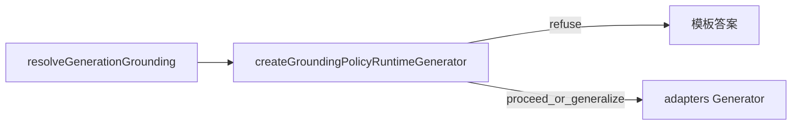

# Generation Grounding Policy — 无依据时的拒答与泛化

> 状态：**已落地**
> 日期：2026-08-24
> 范围：`packages/runtime` generation 包装器；`apps/server` 装配注入
> 关联：[runtime.md](../packages/runtime.md) · [query-routing-upgrade.md](./query-routing-upgrade.md) · [multi-model-roles.md](./multi-model-roles.md)

---

## 背景

runtime 已在空 chunks 时写入 `RuntimeGeneratorInput.grounding.chunksEmptyReason`（`no-hits` | `filtered` | `skipped`），但厂商 generator（adapters）仍一律调 LLM。控制台 `noGroundingPolicy` 曾只在 SSE 层藏 citations，**不阻止**模型调用。

缺口是：管线语义「无依据时拒答还是用模型知识」无人执行。

---

## 决策

**grounding 消费落在 runtime，不进 adapters。**

- `grounding` 由 runtime 产出 → 官方包装器 `createGroundingPolicyRuntimeGenerator` 在 generation 阶段消费
- adapters 保持纯厂商 LLM，继续忽略 `grounding`（正确边界）
- 调用方（如 server）在装配时注入 `NoGroundingPolicy`；runtime **不**读取 apps 的 `StrategyConfig`
- **不**引入完整 GenerationStrategy 链；**不**在本轮让 `createRuntimeFromConfig` 内建 policy

与 [multi-model-roles.md](./multi-model-roles.md) 的区别：多模型是「同一厂商多个 client 的装配」；grounding 是「runtime 自产信号的管线语义」。

---

## 语义矩阵

| `chunksEmptyReason` | `explicit` | `generalize` |
| --- | --- | --- |
| `skipped` | **调 LLM**（routing 主动跳过，必须用模型知识） | 调 LLM |
| `no-hits` | **模板拒答，不调 LLM** | 调 LLM + 注入泛化 `promptContext` |
| `filtered` | **模板拒答，不调 LLM** | 调 LLM + 注入泛化 `promptContext` |
| 有 chunks | 正常 grounded | 正常 grounded |

`skipped` 豁免 `explicit`：对齐 [query-routing-upgrade.md](./query-routing-upgrade.md) —— skip 的产品意图就是「不检索、用模型知识回答」。若对 skip 也模板拒答，会抵消 routing 语义。

---

## 拒答方式

**模板短路**（不调 LLM）：成本低、行为确定、可观测。

拒答时 `generationMetadata` 写入：

- `groundingRefusal: true`
- `chunksEmptyReason`
- `noGroundingPolicy: 'explicit'`

文案可配置；默认中文。本轮不做 LLM 拒答模式。

---

## 做 / 不做

**做：**

- `resolveGroundingPolicyAction` + `createGroundingPolicyRuntimeGenerator`
- server `pipeline-factory` 按 `strategy.generation.noGroundingPolicy` 包装 generator
- ask-stream 优先读 `groundingRefusal` 设 `noGrounding`

**不做：**

- adapters 内任何 grounding policy 代码
- `createRuntimeFromConfig` 内建 `noGroundingPolicy`
- GenerationStrategy 层 / Active RAG
- 统一 `run()` 与 `runStream()` 空答案历史分叉
