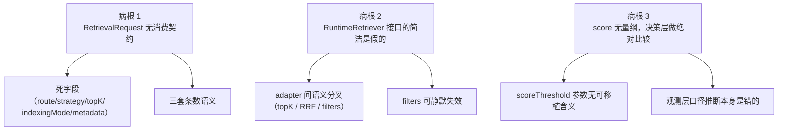

# 内核契约缺陷 — 诊断归档

> 状态：**草案**
> 日期：2026-08-19
> 范围：`packages/`（core / runtime / indexing / adapters / observability）
> 关联：[query-routing-semantics.md](./query-routing-semantics.md)、[query-routing-upgrade.md](./query-routing-upgrade.md)
> 不含：`apps/` 层问题（另开文档）

---

## 为什么写这份文档

起因是评估 [query-routing-upgrade.md](./query-routing-upgrade.md) 时发现 `request.route` 是个没有任何行为性消费方的死字段。进一步排查后确认：**死字段不是个例，而是内核契约层缺陷的外显症状**。

如果只修 `route`，同类问题会以新字段的形式继续出现——`query-routing-upgrade.md` 里计划新增的 `routeDecision.targets` 和 `routeDecision.searchType` 就是下一批。因此先归档病根，再决定各方案的落地顺序。

文档分两部分：**三条病根**（契约设计错误，会导致错误行为）与**两处能力缺口**（内核缺失某一层，不产生错误但会挤压职责并阻塞方案落地）。两者之下是按严重度排列的具体症状。

本文档只陈述**有代码证据的缺陷**，不含修复实现细节。

---

## 三条病根



### 病根 1：`RetrievalRequest` 是一块「意图公告板」

`RetrievalRequest`（`packages/runtime/src/types/retrieval-request.ts:7-23`）承载了 pre-retrieval 阶段的全部产出，但**没有任何契约规定谁必须读取哪个字段**。pre-retrieval 往上贴意图，下游读不读、怎么读，全靠实现者自觉。

结果是相当一部分字段只被 debug / observability / audit 消费，对检索-生成行为零影响：

| 字段 | 写入方 | 行为性消费方 | 仅记录消费 |
| --- | --- | --- | --- |
| `route` | `NoopQueryPreprocessor`、`query-routing` | **无** | debug、observation、audit |
| `strategy` | `NoopQueryPreprocessor`、`query-rewrite`、`build-sub-queries`、`query-routing` | **无** | debug、audit、candidate 记录字段 |
| `topK` | `NoopQueryPreprocessor` | **无**（两个 adapter 都不读） | `isQueryStrategyPassthrough`、audit |
| `indexingMode` | `NoopQueryPreprocessor` | **无** | debug、audit |
| `metadata` | `NoopQueryPreprocessor` | **无**（全 `packages/` 无读取点） | 无 |
| `rerank.topK` | **无写入方** | **无** | audit |
| `filters` | `NoopQueryPreprocessor`、`query-routing` | **无强制点**（见病根 2） | debug、observation、audit |

`PostRetrievalResult.postRetrievalMetadata`（`post-retrieval-result.ts:17`）同样没有任何写入方，是个悬空扩展点。

`request.metadata` 尤其值得注意：调用方传入的业务 metadata 被复制进 request（`noop-query-preprocessor.ts:37`）后再无人读取，属于静默丢弃。

### 病根 2：`RuntimeRetriever` 接口的简洁是假的

接口只声明一个方法：

```typescript
export interface RuntimeRetriever {
  retrieve(request: RetrievalRequest, context: RuntimeContext): Promise<RuntimeRetrievalResult>;
}
```

但一个「行为正确」的 retriever 实际上必须履行至少四条**不成文契约**：

1. 自行调用 `filterRetrievalCandidatesByIndexingFilters` 应用 `request.filters`
2. 自行调用 `createIndexingRetrievalCandidate` 构造 candidate（否则 `sourceId` / `hierarchyPath` 等字段缺失，后续 filter 与 citation 失效）
3. 自行读取 `request.budget?.maxChunks` 并截断
4. 自行决定是否做 RRF 融合

这四条没有一条写在接口里，全部只存在于两个内置 adapter 的代码习惯中。其直接后果：

**`filters` 可以静默失效。** `request.filters` 在整个 `packages/runtime/src` 里没有任何强制应用点，四处消费全是记录性质：`run-runtime.ts:447`（debug）、`assemble-runtime-result.ts:316`（audit）、`build-observation-attributes.ts:103`（observation）、`query-protocol.ts:294`（提供给 retriever 自愿调用的 helper）。任何第三方按签名实现 `RuntimeRetriever` 都会得到一个 filters 不生效的检索器，而 filters 常用于租户隔离与来源限定。

更糟的是 langchain adapter 提供了显式关闭开关：

```159:162:packages/adapters/src/langchain/retrievers/langchain-runtime-retriever-adapter.ts
    const filteredCandidates =
      this.#options.filterByRequest === false
        ? candidates
        : filterRetrievalCandidatesByIndexingFilters(candidates, request.filters);
```

`filterByRequest: false` 之后，`request.filters` 照样出现在 debug 和 audit 里，可观测性会报告过滤条件生效，实际没有。

**契约工具没有独立分层。** adapter 必须从 `@monai-ragsdk/runtime` 包根 import runtime 的内部实现函数才能正确实现接口（`pg-vector-runtime-retriever-adapter.ts:2-11`、`langchain-runtime-retriever-adapter.ts:2-5`）。这既让 adapters 与 runtime 内部实现耦合，也迫使 runtime 把内部工具永久暴露为公开 API（见高危项 7）。

**接口无身份、无能力声明、无生命周期。** retriever 没有 `name` / `id`，也无法声明自己支持哪些检索模式；`PgVectorRuntimeRetrieverAdapter` 实现了 `close()`（`:153-155`）但接口里没有，runtime 无法统一释放资源。

**契约不成文到内核自己的 demo 都不遵守。** `packages/runtime/demo/strategy-pipeline.ts:33-47` 里的示例 retriever 直接返回裸 candidate 对象，既不调用 `createIndexingRetrievalCandidate`，也不应用 `request.filters`：

```typescript
retriever: {
  async retrieve(request) {
    return {
      candidates: [{ chunk: { id: `chunk-${...}`, content: ... }, score: ... }],
    };
  },
},
```

这正是第三方实现者会写出的代码——按签名满足接口，但缺失全部隐含契约。demo 作为「推荐写法」的示范，反而固化了错误示例。

### 病根 3：`score` 是无量纲裸数字，决策层却对它做绝对比较

`RetrievalCandidate.score` 只有类型没有口径：

```3:5:packages/runtime/src/types/retrieval-candidate.ts
export type RetrievalCandidate = {
  chunk: Chunk;
  score?: number;
```

而内核**明确知道**分数存在多种不可比口径——它为此专门定义了枚举，并写下了注释：

```5:5:packages/runtime/src/observation/build-observation-attributes.ts
export type ObservationScoreKind = 'retriever' | 'rrf' | 'llm';
```

```272:277:packages/runtime/src/pipeline/run-runtime.ts
/** fan-out 融合后的分数是 RRF 口径；其它 retriever 仍是原始检索分。 */
function retrievalScoreKind(
  retrievalResult: RuntimeRetrievalResult,
): 'retriever' | 'rrf' {
  return retrievalResult.retrievalMetadata?.provider === 'fan-out' ? 'rrf' : 'retriever';
}
```

问题在于 `scoreKind` **只存在于 observability 的数据结构上**（`ObservationCandidateRef`，`build-observation-attributes.ts:12`、`:135`），而 post-retrieval 策略拿到的 `RetrievalCandidate` 上没有这个字段。也就是说：内核为了「把分数口径告诉人类」建了一套模型，却没有把同样的信息交给做决策的代码。

于是 `score-threshold` 只能对一个量纲未知的数字做绝对值比较：

```217:220:packages/runtime/src/stages/post-retrieval/strategies/post-retrieval-strategies.ts
    const belowThreshold =
      scoreThreshold !== undefined &&
      candidate.score !== undefined &&
      candidate.score < scoreThreshold;
```

**量级差异是数量级的。** RRF 分为 `Σ 1/(k + rank + 1)`，`k` 默认 60（`fuse-by-rrf.ts:8,31`）。单路命中首位得 `1/61 ≈ 0.0164`；pgvector 是向量 + 关键词双路，即便两路都命中首位也只有 `≈ 0.033`。而余弦相似度口径下的分数通常在 0.7–0.95 区间。

因此 `scoreThreshold` 这个参数**没有可移植的含义**：按余弦相似度直觉配置的阈值（如 0.2）作用在 RRF 分上会丢弃全部候选；反之按 RRF 量级配置的阈值作用在余弦分上则完全不过滤。同一份配置换 retriever 就从「全丢」翻转为「全留」，且没有任何告警。

**连观测层的口径推断本身也是错的。** `retrievalScoreKind` 靠 `provider === 'fan-out'` 判断，而 pgvector adapter 内部做了 RRF 融合却返回 `provider: 'pgvector'`（`pg-vector-runtime-retriever-adapter.ts:121-124,142`），于是它的 RRF 分会被标记成 `'retriever'`（原始检索分）。observability 数据在这一点上不可信。

---

## 两处能力缺口

与上面三条病根不同，这两项不是「契约写错了」，而是**内核根本没有这一层**。它们不产生错误行为，但会把职责挤到调用方，并成为若干方案的落地前置条件。

### 缺口 1：generation 阶段没有策略层，generator 无法区分「为什么没有依据」

`pre-retrieval` 与 `post-retrieval` 都有 `strategies/` 目录和策略链编排器，`generation` 阶段只有三个文件（`runtime-generator.ts` / `iterate-generation-stream.ts` / `index.ts`），没有任何策略或 policy 概念。

generator 拿到的输入只有三个字段：

```5:10:packages/runtime/src/types/runtime-generator-input.ts
/** generate / generateStream 共用输入，避免两套签名分叉。 */
export type RuntimeGeneratorInput = {
  request: RetrievalRequest;
  chunks: Chunk[];
  promptContext?: string;
};
```

于是 generator 判断「有没有检索依据」的唯一手段是 `chunks.length === 0`。而 chunks 为空至少有三种成因：检索确实无结果、被 `score-threshold` 全量过滤（见病根 3，这在口径错配时必然发生）、以及路由决定跳过检索（若实现 `retrievalMode: "skip"`）。**这三种情况在 generator 侧完全不可区分**，因此内核无法表达「无依据时应该明确拒答」与「无依据时应该用模型自身知识回答」这两种截然不同的策略。

### 缺口 2：没有官方装配层，「策略配置 → runtime」的组装逻辑无处复用

内核只提供 `createDefaultRuntime()` 这种原子拼装 API（`packages/runtime/src/pipeline/create-default-runtime.ts`），没有「按配置编译出 runtime」的入口。任何调用方都必须自己手拼 `StrategyQueryPreprocessor` + `FanOutRetriever` + `StrategyRetrievalPostprocessor` + `createDefaultRuntime` 四件套，并自行决定策略顺序与默认值。

内核自己的 demo 也在重复这套手拼（`packages/runtime/demo/strategy-pipeline.ts:25-51`），这说明缺层不是调用方的使用姿势问题。

这个缺口与高危项 4（策略顺序无 enforcement）互为因果：既然没有任何一处集中定义「正确的策略顺序」，顺序知识就只能散落在每个调用方的数组字面量里。

---

## 高危项

### 1. score 口径混乱（病根 3 的直接后果）

见上。这是本次诊断中唯一**同时构成正确性缺陷**的项：不是「字段浪费」，而是「阈值语义不成立 + 观测数据错误」。

### 2. 三套「条数」语义并存

`request.topK`、`request.budget.maxChunks`、`request.rerank.topK` 表达同一个意图，消费方各读各的：

- `query-routing` 把 LLM 输出的 `topK` 写进 `budget.maxChunks`，**从不写** `request.topK`（`query-routing-strategy.ts:110-114`）
- pgvector adapter 只读 `budget.maxChunks`，兜底硬编码 `?? 3`（`:113`）
- audit 只导出 `request.topK`（`assemble-runtime-result.ts:340`）
- `rerank.topK` 无写入方也无消费方

后果：一次请求可以同时携带 `topK=8` 与 `budget.maxChunks=2`，审计报告显示 8，实际按 2 执行，无法对账。

### 3. 两个内置 adapter 对同一份 request 有不同行为

| 维度 | pgvector | langchain（默认路径） |
| --- | --- | --- |
| 条数限制 | 读 `budget.maxChunks ?? 3`，filter 后 `.slice(0, topK)` | **不读** topK/budget，不截断 |
| RRF 融合 | 向量 + 关键词双路 + RRF | 无，单次 `invoke` |
| score 口径 | RRF 分（≈0.016–0.033） | 底层 `document.score`（口径未知） |
| `retrievalMetadata` | 结构化返回，含 `searchType` | 默认 `undefined` |
| filters | 强制应用 | 可用 `filterByRequest: false` 关闭 |

证据：`pg-vector-runtime-retriever-adapter.ts:112-148`；`langchain-runtime-retriever-adapter.ts:123-177`。

后果：同一套策略配置换 adapter 后，候选数量、排序算法、分数口径、过滤行为全部改变，且 post-retrieval 的 `scoreThreshold` / 去重 / 排序策略跨 adapter 不可比。

### 4. post-retrieval 策略顺序存在隐式依赖，内核无任何约束机制

`llm-rerank` 的文档注释声明它写回 score 供后续 `score-threshold` 消费：

```152:154:packages/runtime/src/stages/post-retrieval/strategies/llm-rerank-strategy.ts
 * - 若 LLM 返回 score：写回 candidate.score，便于后续 score-threshold 策略消费。
```

写回确实发生（`:245-248`）。但内核默认链把 `score-threshold` 放在**首位**，且默认链不含 `llm-rerank`：

```25:37:packages/runtime/src/stages/post-retrieval/passthrough-retrieval-postprocessor.ts
  const strategies: PostRetrievalStrategy[] = [
    createScoreThresholdStrategy({ ... }),
    createPredicateFilterStrategy(options.candidatePredicate),
    createNearDuplicateRemovalStrategy(options.nearDuplicateRemovalConfig),
    createBudgetTrimStrategy({ ... }),
    createSourceCoverageStrategy(options.sourceCoverageConfig),
  ];
```

用户自行组装策略数组时（`StrategyRetrievalPostprocessor` 严格按数组顺序执行），把 rerank 放在 threshold 之后是很自然的选择——精排在粗筛之后。此时注释承诺的协作关系不成立，threshold 用的是 retriever 原始分。内核既不声明这个顺序依赖，也不在运行时校验或告警。

### 5. `llm-rerank` 失败后仍留下「已生效」的脏状态

副作用发生在 `try` 之前，且是对传入 `request` 的原地 mutate：

```169:171:packages/runtime/src/stages/post-retrieval/strategies/llm-rerank-strategy.ts
      // 给 runtime debug 的可观测字段；mutation 是可控副作用，仅用于诊断。
      request.rerank = request.rerank ?? { strategy: 'llm-rerank' };
      request.rerank.strategy = 'llm-rerank';
```

LLM 调用失败并 passthrough 时（`:198-206`），重排根本没发生，但 debug / audit 显示 `rerankStrategy: 'llm-rerank'`。这也是 `packages/runtime/src` 里唯一一处直接改写传入 `request` 的策略，与其余策略「返回新对象」的模式不一致。

### 6. `llm-rerank` 在零候选时仍调用 LLM

`subset = candidates.slice(0, ...)` 为空数组时照样拼 prompt 并 `model.complete`（`:173-187`），无短路。检索零结果时仍产生费用与延迟，且空候选 prompt 下模型行为不可预测。对比 `context-compression-strategy.ts:90-92` 有正确短路。

### 7. 内部实现已被测试锁定为公开契约

`packages/runtime/src/index.ts` 通过 barrel 把 stages / pipeline / indexing 全量 `export *`，而 `exports.spec.ts` 进一步把这些内部函数**断言**为受保护的 dist 导出：

```19:19:packages/runtime/__tests__/exports.spec.ts
    expect(Object.keys(distExports).sort()).toEqual(Object.keys(srcExports).sort());
```

第 27-54 行逐个断言 `applyScoreThresholdStrategy`、`fuseByReciprocalRankFusion`、`createIndexingRetrievalCandidate`、`parseRewrittenQuery` 等必须存在。

后果：**这是所有契约层修复的成本约束**。收窄 export 面会撞上第 19 行的 `toEqual`；重命名或调整任何内部工具签名会撞上后面的逐项断言。修复必须显式决策是否修改这个测试，无法绕过。

---

## 中等严重项

**`create-collection` 的能力探测是冗余的。** `VectorStore` 接口**已经**声明了 `deleteByFilter?` / `listSourceRecords?` / `close?`（`packages/indexing/src/stores/vector-store.ts:25-31`），但 collection 门面仍用 `as unknown as {可选方法}` + `typeof !== 'function'` 重新发明一遍（`create-collection.ts:105-110,121-131,139-147`）。这不是补接口缺失，是绕过已有的类型契约，且会掩盖后续 `VectorStore` 签名变更导致的类型错误。

**core 与 runtime 各有一套 Retriever/Generator 接口。** `packages/core/src/interfaces/retriever.ts:3-5` 是 `retrieve(query): Promise<Chunk[]>`，runtime 是 `retrieve(request, context): Promise<RuntimeRetrievalResult>`，两者不兼容且都被 export。实现者无法从 API 面判断该实现哪个，adapters 实际只认 runtime 侧。

**Filters / Budget 在 core spec 与 runtime 双份维护。** `packages/core/src/spec/rag-response.ts:65-66` 的注释直接写「对齐 runtime RetrievalFilters」，靠 `assemble-runtime-result.ts:70-89` 的 `toAuditFilters` / `toAuditBudget` 手工映射。字段增删需双处同步。

**`appliedStrategies` 与实际效果脱钩。** 策略 LLM 失败并内部 passthrough 时，编排器仍把策略名 append 进列表（`strategy-query-preprocessor.ts:46-52`）。审计显示「跑过 query-rewrite」，实际 `effectiveQuery` 未变。

**passthrough 判定字段不完整。** `isQueryStrategyPassthrough`（`emit-runtime-observation.ts:118-126`）不比较 `strategy` / `rerank` / `indexingMode`，会把「改了这些字段但未改 query」的策略标记为 passthrough。

**`query-routing` 失败时仍写 `rewriteReason`。** route 缺失且 `onError` 为默认 `undefined` 时不 early return，仍构造带 `rewriteReason: 'query-routing'` 的 next（`query-routing-strategy.ts:99-108`），审计上看像成功路由。

**`run()` 与 `runStream()` 对空答案行为刻意不一致。** 流式路径对空 answer 抛错，非流式允许返回空字符串，注释确认这是刻意区分：

```690:698:packages/runtime/src/pipeline/run-runtime.ts
    // 流式路径要求最终答案非空；与 run() 允许空字符串的历史行为刻意区分
    if (!generationResult.answer.trim()) {
      throw toRuntimeError(
```

同一个 generator 在两种 API 下有不同的边界语义。

**post-retrieval 结果契约冗余。** `chunks` 是权威输出，但 `selectedCandidates` / `droppedCandidates` 是 optional，导致下游到处 `??` 兜底推算（`run-runtime.ts:374-377`、`assemble-runtime-result.ts:264-265`）。自定义 postprocessor 只填 `chunks` 时，dropped 数量靠减法估算。

**`mergeSelectionTrace` 按 chunkId 覆盖。** 同一候选在多阶段的决策历史只保留最后一次（`post-retrieval-strategies.ts:597-612`），无法还原完整决策链。

**离线索引概念泄漏到查询期。** `RetrievalRequest.indexingMode`、`RetrievalCandidate.sourceId` / `fingerprint` 出现在查询链路类型上；另有 `packages/runtime/src/indexing/` 模块与 `packages/indexing` 包命名冲突，「indexing 语义」的实现分散在两处。

**`run-runtime.ts` 职责过载。** 843 行内混合会话/trace 管理、observability 映射发射、三阶段编排、流式归一化、debug 组装、失败收尾六类职责；三条执行路径各自复制了 `runtime.query.receive` 与 generation 完成事件块。

---

## 低严重项

- pre-retrieval 各 LLM 策略不校验空 query，空字符串仍会调用模型
- ordering 类策略恒返回 `droppedCandidates: []`，与 filter 类策略不对称，使 dropped 统计只能靠减法
- `RuntimeCitation` 是 `RAGCitation` 的纯 alias，无 runtime 自有语义

---

## 未发现的问题（排除项）

为避免后续重复排查，记录已确认**不存在**的问题：

- 包间**无循环依赖**；依赖方向为 `core → observability → indexing → runtime → adapters`，无层次倒置
- `indexing` 不依赖 `runtime`，反向泄漏不存在
- `Chunk` / `Document` / `Vector` 无重复定义，indexing 通过 re-export 复用 core
- `packages/runtime/src/observation/` 未从包根泄漏，是正确的内部模块
- `as any` 在 `packages/` 中零出现；LangChain / LLM JSON 边界的鸭子类型判别属必要防御
- 无完全无人引用的孤立类型文件

---

## 修复优先级

优先级依据「是否影响正确性」与「是否需要破坏性变更」两个维度。

| 级别 | 内容 | 是否需破坏 export 面 |
| --- | --- | --- |
| **P0** | score 口径：给 `RetrievalCandidate` 补口径信息，让 `score-threshold` 能按口径判断或拒绝执行；修正 `retrievalScoreKind` 对 pgvector 的误判 | 否（加字段） |
| **P0** | `llm-rerank`：mutate 移入成功分支、零候选短路 | 否 |
| **P1** | 缺口 1：给 `RuntimeGeneratorInput` 补「无依据成因」信号，使 grounding 策略可表达 | 否（加字段） |
| **P1** | `RetrievalRequest` 字段收敛：三套条数语义统一、死字段清理或明确标注为纯观测字段 | 是 |
| **P1** | `RuntimeRetriever` 契约补全：身份标识、能力声明、生命周期、`filters` 强制点 | 是 |
| **P2** | 缺口 2：提供官方装配层，把策略顺序知识收敛到内核一处 | 否（新增 API） |
| **P2** | 契约工具独立分层，收窄 runtime export 面 | 是（须先改 `exports.spec.ts`） |
| **P2** | 拆分 `run-runtime.ts`；统一 core/runtime 双份接口；消除 Filters/Budget 双份定义 | 部分 |

**P0 的选择理由**：这两项都能在不动公开 API 面的前提下完成，且修的是正确性问题而非整洁度问题。先做 P0 可以在不触发高危项 7 那道测试墙的情况下拿到实际收益。

**P1 的前置条件**：其中两项（`RetrievalRequest` 字段收敛、`RuntimeRetriever` 契约补全）涉及类型收窄或接口扩展，必须先决定 export 面策略（高危项 7），否则会在 `exports.spec.ts` 处受阻。缺口 1 只是给 `RuntimeGeneratorInput` 加可选字段，不受此约束，可与 P0 并行。

---

## 对 query-routing-upgrade 方案的重新定位

结合本文档，[query-routing-upgrade.md](./query-routing-upgrade.md) 的三个 `RouteDecision` 字段落地条件如下：

- **`retrievalMode: "skip"`** — 「让 retriever 返回空 candidates」这一半可以立即实现，但**完整语义依赖缺口 1**。skip 的目的是「不检索、让模型用自身知识回答」，而 generator 只能看到 `chunks: []`，无法区分这是路由主动跳过还是检索失败，因此仍会按「无依据」处理。方案原文所称「generator 自行处理空 candidates，直接用 LLM 回答」在当前内核下不成立。
- **`targets`** — 依赖 **P1 的 retriever 身份标识**。当前 `RuntimeRetriever` 无 name/id，`FanOutRetriever` 持有的是匿名数组，`targets: string[]` 没有可匹配的键。
- **`searchType`** — 依赖 **P1 的 retriever 能力声明**。pgvector 硬编码 hybrid，langchain 无此概念；在能力可声明、可切换之前，该字段只能被写入而无法被执行。

结论：该方案的三个字段**没有一个能在当前内核上完整落地**。`skip` 最接近，但需先补缺口 1（P1，仅加字段、不破坏 API 面）；`targets` / `searchType` 需等 P1 的 retriever 契约补全。建议不要在病根与缺口未修的情况下向 `RetrievalRequest` 追加 `routeDecision`，否则只会得到第五个死字段。

另需指出三份决策文档之间存在**责任回避闭环**：`server-api-redesign.md:235` 把「按 route 标签自动选库」排除并推给 query-routing 文档；`query-routing-upgrade.md:117` 又称「具体消费方式取决于底层 retriever 的能力」推给检索层；而「给 retriever 加身份与能力声明」这项真正的前置工作三份文档均未认领。本文档将其明确归入 P1。

---

## 调查方法

- 对 `RetrievalRequest` / `PostRetrievalResult` 的每个字段做「写入方 → 消费方」全仓库反查，区分行为性消费与记录性消费
- 对比两个内置 retriever adapter 对同一 request 的解读差异
- 核对 `packages/` 各包 `package.json` 依赖与 barrel export 链
- 全仓库扫描 `as unknown as` / `as any` / 鸭子类型判别，逐处判定是边界防御还是接口缺失补丁

本次范围限定 `packages/`。`apps/` 层的消费方问题（重复装配逻辑、上层补内核语义、状态与并发设计、工程卫生）另开文档。
