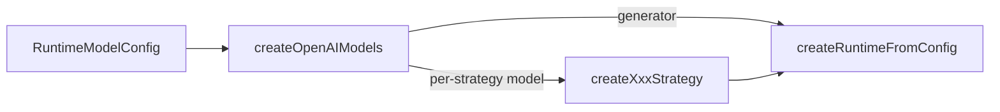

# 多模型 — 调用方配置

> 状态：**草案**
> 日期：2026-08-20
> 范围：在线 RAG 管线中除 embedding 外的 LLM 模型选型与装配约定
> 关联：[runtime.md](../packages/runtime.md) · [adapters.md](../packages/adapters.md)

---

## 背景

在线 RAG 管线里，除 embedding 外至少有三类 LLM 用途，成本与质量诉求不同：

| 阶段 | 典型用途 | 质量 / 延迟 / 成本特征 |
| --- | --- | --- |
| pre-retrieval | 改写、扩展、分解、多路查询、LLM 路由 | 短 prompt、可偏小模型；routing 需结构化 JSON |
| post-retrieval | rerank、context compression | rerank 对排序质量敏感；compression 可偏小模型 |
| generation | 最终 grounded 答问 | 通常需要最强模型 |

**内核现状**：`packages/runtime` 各 LLM 策略工厂已接受 `model: RuntimeStrategyModel`；`RuntimeGenerator` 与策略模型是独立接口。接口层**已支持**按策略注入不同模型。

**实际缺口**不在 runtime 类型，而在装配叙事与示例路径：

1. [`createOpenAIChatAdapters`](../../packages/adapters/src/openai/shared/create-openai-chat-adapters.ts) 一次配置产出同一 `model` 的 generator + strategyModel，文档暗示「除 embedding 外全共用」。
2. [`OpenAIChatClient`](../../packages/adapters/src/openai/shared/openai-chat-client.ts) 构造时绑定 `model`（合理）；多模型 = 多 client 实例，而非改 `complete()` 签名。
3. `apps/server` 的 [`shared-stack`](../../apps/server/src/services/shared-stack.ts) + [`pipeline-factory`](../../apps/server/src/services/pipeline-factory.ts) 把单一 `strategyModel` 灌入 rewrite / rerank / compression 等全部策略。

因此本决策定的是：**调用方如何持有配置、如何兜底、adapters 提供什么小工具**——不在 runtime 内增解析层。

---

## 决策

**多模型是装配问题，不是内核新能力。**

- 调用方（apps / 自建装配）持有配置对象，在 `createQueryRewriteStrategy({ model })` 等处注入对应实例。
- 未单独指定的策略按固定兜底规则解析。
- `packages/adapters` 可提供从配置字符串批量建实例的小工具；**不**在 adapters 内编译 query/post 策略数组。
- **不**在 runtime 新增 `RuntimeModelRoles`、`resolveRuntimeModelRoles`、扩展 `createRuntimeFromConfig` 吃整表 models 等解析层。
- embedding（`Embedder`）独立配置，不在本决策的配置表内。



---

## 做 / 不做

**做（后续实现，本文先定约定）：**

- 调用方配置形态 `RuntimeModelConfig` 与逐字段继承规则（本文 §2–§3）
- adapters 小工具 `createOpenAIModels(config)`：按配置建多个 `OpenAIChatClient` / `RuntimeStrategyModel` / `RuntimeGenerator`
- 保留 `createOpenAIChatAdapters` 为单 model 快捷方式，文档标明适用场景
- apps 装配层（如 server `pipeline-factory`）按策略键注入不同 model
- 策略 trace metadata 带上实际 model id（§6）

**不做：**

- runtime 包内 roles 解析器或策略工厂改 `model?` 可选
- `RuntimeStrategyModel.complete` 增加 per-call `model` 覆盖
- Active RAG / 按 route 选 generator
- 把 embedding 并入 roles 表
- 为观测新增 observability 事件类型或必填字段（只用既有 metadata，§6）
- 把 model 选择放进 `StrategyConfig` / 控制台 UI（首轮只走 env，§7）
- `createOllamaModels`（需先补 ollama chat client 抽象，§5）

---

## 1. 策略键与消费点

配置键与 runtime 策略工厂一一对应。前七个位于 `strategies.*` 下，`generation` 是配置顶层键（见 §2）：

| 配置键 | 策略工厂 | 阶段 |
| --- | --- | --- |
| `rewrite` | `createQueryRewriteStrategy` | pre-retrieval |
| `expansion` | `createQueryExpansionStrategy` | pre-retrieval |
| `decomposition` | `createQueryDecompositionStrategy` | pre-retrieval |
| `multiQuery` | `createMultiQueryStrategy` | pre-retrieval |
| `routing` | `createLlmRoutingStrategy`；`createRoutingStrategy({ resolver: LlmRoutingResolver })` 同槽位 | pre-retrieval |
| `rerank` | `createLlmRerankStrategy` | post-retrieval |
| `compression` | `createContextCompressionStrategy` | post-retrieval |
| `generation` | `RuntimeGenerator`（如 `OpenAIRuntimeGenerator`） | generation |

**不占 model 槽位：**

- `createRuleBasedRoutingStrategy`（规则路由，无 LLM）
- 非 LLM post 策略：score-threshold、dedupe、budget-trim、source-coverage、ordering、lost-in-the-middle 等

---

## 2. 调用方配置形态

纯数据对象，由**调用方**填写与持有；类型定义随 adapters 工具走（见末条），**不**进入 `@monai-ragsdk/runtime` 包根导出。

```typescript
/**
 * 单个 LLM 端点描述；model 与 baseUrl 必填。
 * 连接层字段与 OpenAIChatClientOptions 对齐：不同端点可能需要不同 fetch
 * （如策略走 Dots 网关改写 api-key 头、generation 走标准 OpenAI）。
 */
type ModelEndpoint = {
  model: string;
  baseUrl: string;
  apiKey?: string;
  timeoutMs?: number;
  maxRetries?: number;
  fetch?: FetchLike;
};

/** 覆盖项：只写与 default 不同的字段，其余逐字段继承 default。 */
type ModelEndpointOverride = Partial<ModelEndpoint> & Pick<ModelEndpoint, 'model'>;

type StrategyKey =
  | 'rewrite'
  | 'expansion'
  | 'decomposition'
  | 'multiQuery'
  | 'routing'
  | 'rerank'
  | 'compression';

/**
 * 在线 RAG 模型配置。
 * - default 必填：策略 LLM 与 generation 的共同兜底。
 * - generation 可选：答问模型；缺省沿用 default 的全部字段。
 * - strategies 可选：按策略键覆盖，未写字段继承 default。
 */
type RuntimeModelConfig = {
  default: ModelEndpoint;
  generation?: ModelEndpointOverride;
  strategies?: Partial<Record<StrategyKey, ModelEndpointOverride>>;
};
```

说明：

- `generation` 与 `strategies.*` 使用**同一套字段级继承**（见 §3），不存在「整体替换」语义；只换模型时写 `{ model: 'gpt-4o' }` 即可，连接参数自动继承。
- `default.baseUrl` 必填：`createOpenAIClient` 要求 baseUrl 由调用方显式传入，可选会把校验推迟到运行时抛错。
- `apiKey` 仍可缺省，由 `OpenAIChatClient` 回退 `OPENAI_API_KEY`（现状行为，不改）。
- `fetch` 必须是 per-endpoint 而非全局单例：server 的 `createDotsChatFetch` 会给请求体注入 `chat_template_kwargs`，套到非 Dots 端点上是错的。
- 类型名 `RuntimeModelConfig` 仅为本文约定。**归属只能是 adapters（或更底层共享包）**：`createOpenAIModels(config)` 在 adapters 内消费它，adapters 不能反向依赖 apps；runtime 不导出。

---

## 3. 兜底规则

解析**两层且逐字段**，不做可配置回退图。`generation` 与策略键走同一条规则，只是取覆盖项的位置不同：

| 目标 | 覆盖项 | 解析 |
| --- | --- | --- |
| 策略键 `K` | `config.strategies?.[K]` | 每个字段：覆盖项 → 否则 `config.default` 同名字段 |
| `generation` | `config.generation` | 同上 |

补充：

1. **同一物理 model 仍建独立的包装实例**：`OpenAIStrategyModel` 与 `OpenAIRuntimeGenerator` 的职责与 system prompt 不同，即使 default 与 generation 同为 `gpt-4o` 也各建一个，不强行合并。
2. **底层 `OpenAIChatClient` 按连接三元组去重**：`baseUrl + apiKey + model`（含同一 `fetch` 引用）相同的键共用一个 client。这与现状 `createOpenAIChatAdapters` 让 generator / strategyModel 共享 client 的行为一致——独立的是包装层，不是连接层。
3. **实例急切构造，不按策略开关裁剪**。建一个 client 只是构造 SDK 对象，成本远低于为此引入 lazy getter 的 API 复杂度；配置缺 baseUrl / apiKey 时早失败也比请求期才炸好。策略开关只决定**是否把实例传给工厂**，由 apps 的 `pipeline-factory` 负责。

伪代码：

```typescript
/** 逐字段继承 default；generation 与策略键共用此函数，避免两套语义。 */
function resolveEndpoint(
  config: RuntimeModelConfig,
  override: ModelEndpointOverride | undefined,
): ModelEndpoint {
  const base = config.default;
  return {
    model: override?.model ?? base.model,
    baseUrl: override?.baseUrl ?? base.baseUrl,
    apiKey: override?.apiKey ?? base.apiKey,
    timeoutMs: override?.timeoutMs ?? base.timeoutMs,
    maxRetries: override?.maxRetries ?? base.maxRetries,
    fetch: override?.fetch ?? base.fetch,
  };
}

const strategyEndpoint = (config: RuntimeModelConfig, key: StrategyKey) =>
  resolveEndpoint(config, config.strategies?.[key]);

const generationEndpoint = (config: RuntimeModelConfig) =>
  resolveEndpoint(config, config.generation);
```

---

## 4. 装配示例

与现有 [`createRuntimeFromConfig`](../../packages/runtime/src/pipeline/create-runtime-from-config.ts) 完全兼容：仅把不同 `model` 实例传入已有工厂。

```typescript
import {
  createRuntimeFromConfig,
  createQueryRewriteStrategy,
  createLlmRoutingStrategy,
  createLlmRerankStrategy,
  createContextCompressionStrategy,
} from '@monai-ragsdk/runtime';
// 后续由 adapters 提供：
import { createOpenAIModels, type RuntimeModelConfig } from '@monai-ragsdk/adapters';

// apps 自有的网关适配，如 server 的 createDotsChatFetch()
const dotsFetch = createDotsChatFetch();

const config: RuntimeModelConfig = {
  default: { model: 'gpt-4o-mini', baseUrl: 'https://api.example.com/v1', fetch: dotsFetch },
  // 只换模型；baseUrl / apiKey / fetch 逐字段继承 default
  generation: { model: 'gpt-4o' },
  strategies: {
    rerank: { model: 'gpt-4o' },
    routing: { model: 'gpt-4o-mini' },
  },
};

const models = createOpenAIModels(config);

const queryStrategies = [];
if (flags.routing) {
  queryStrategies.push(createLlmRoutingStrategy({ model: models.routing, availableTargets }));
}
if (flags.rewrite) {
  queryStrategies.push(createQueryRewriteStrategy({ model: models.rewrite }));
}

const postRetrieval: AssemblePostRetrievalStrategiesConfig = {};
if (flags.rerank) {
  postRetrieval.rerank = createLlmRerankStrategy({ model: models.rerank });
}
if (flags.compression) {
  postRetrieval.compression = createContextCompressionStrategy({ model: models.compression });
}

const runtime = createRuntimeFromConfig({
  retriever,
  generator: models.generator,
  observer,
  query: { strategies: queryStrategies },
  postRetrieval,
});
```

**单 model 快捷路径**（与今天行为等价，仍合法）：

```typescript
const { generator, strategyModel } = createOpenAIChatAdapters({
  model: 'gpt-4o',
  baseUrl,
  apiKey,
});

createQueryRewriteStrategy({ model: strategyModel });
createLlmRerankStrategy({ model: strategyModel });
createRuntimeFromConfig({ retriever, generator, ... });
```

多模型场景应显式改用 `createOpenAIModels` + 按策略注入，而不是继续复用单一 `strategyModel`。

### 生命周期

`createOpenAIModels` 的结果是**进程级**的，与 server 现在的 `strategyModel` 同级：挂在 `shared-stack` 上构造一次，`pipeline-factory` 每请求只挑实例注入工厂。

不要在 `buildRuntime` 内部按请求调用 `createOpenAIModels`——那会为每个请求 new 出一批 OpenAI SDK 客户端，丢掉连接复用与 SDK 内置重试状态。策略开关是每请求可变的，模型配置不是。

---

## 5. adapters 后续边界

实现 `createOpenAIModels(config: RuntimeModelConfig)` 时遵守：

**做：**

- 按 §3 规则急切构造并返回具名实例 `{ generator, rewrite, expansion, decomposition, multiQuery, routing, rerank, compression }`
- 按 `baseUrl + apiKey + model + fetch` 去重 `OpenAIChatClient`；包装层（`OpenAIStrategyModel` / `OpenAIRuntimeGenerator`）各自独立
- 在 adapters 内定义并导出 `RuntimeModelConfig` / `ModelEndpoint`（依赖方向决定，见 §2 末条）
- 保留 `createOpenAIChatAdapters` 为单 model 快捷方式（内部可视为无 override 的特例）

**不做：**

- 在 adapters 内根据策略开关编译 `queryStrategies` / `postRetrieval` 数组（属于 apps 的 `pipeline-factory` 职责）
- 修改 `RuntimeStrategyModel` 接口

**Ollama 对称化（明确排除在首个 PR 外）：** ollama 侧目前只有 `ollama/shared/http.ts`，没有与 `OpenAIChatClient` 对称的 chat client 抽象。要提供 `createOllamaModels` 需先补这层，成本不小；`RuntimeModelConfig` 类型本身 provider 无关，届时可直接复用。

---

## 6. 观测

链路已经通：`OpenAIChatClient.model` 是公开 `readonly`，`OpenAIStrategyModel.chatClient` 已有 getter。因此策略相关 trace / audit metadata **应当**带上实际 model id，而不只是「建议」。

理由不是好看：没有它，「未配置的策略回退到 default」在线上无法确认，只能靠单测 spy 断言；「小模型 rerank + 大模型 generation」是否真的生效也看不出来。

仍然**不**为此新增 observability 事件类型或必填字段——只往既有 metadata 里塞字符串。

---

## 7. 落地顺序（实现阶段）

本文仅为设计定稿；代码按以下顺序推进：

1. **adapters**：`createOpenAIModels` + `RuntimeModelConfig` 类型 + 单元测试；README 增加多模型示例；`createOpenAIChatAdapters` 文档注明快捷场景
2. **apps/server**：`shared-stack` 用 `createOpenAIModels` 替换单 `strategyModel`（进程级，见 §4 生命周期）；`pipeline-factory` 按策略键注入
3. **Wiki**：`adapters.md` 同步 `createOpenAIModels` 现状；`routing.md` 一览表与横切事实同步

### 配置来源：先只走 env

第 2 步的配置**只从 env 读**（`DOTSAI_*` / `OPENAI_*` 之外，按策略键加覆盖变量），不进 `StrategyConfig`。

代价是控制台不能按知识库改模型——接受。把 model 选择放进 `StrategyConfig` 意味着要改 server DTO、`apps/web` 的类型与 `StrategyPage` UI，范围远超本决策；等 env 路径跑通、确有按库调模型的需求再单独决策。

---

## 8. 验收（实现完成后）

- 可为 rewrite / rerank / generation 配置不同 model，且未配策略回退到 `default`
- 只写 `{ model }` 的覆盖项能继承 `default` 的 baseUrl / apiKey / fetch，不因缺字段构造失败
- server 的 Dots 链路（`createDotsChatFetch`）在多模型装配下仍可用
- runtime 包根无新增 model 解析 API；`createRuntimeFromConfig` 签名不变
- 单 model 快捷路径（`createOpenAIChatAdapters`）行为与改前一致
- trace 中能读到各策略实际使用的 model id（§6）
- server 或 example 至少一处演示多 model 装配（非本文档范围，实现阶段验收）
