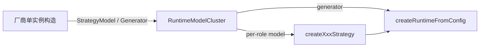

# 多模型 — 单实例构造与模型簇聚合

> 状态：**草案**
> 日期：2026-09-08
> 范围：在线 RAG 管线中除 embedding 外的 LLM 选型、注册与装配约定
> 关联：[runtime.md](../packages/runtime.md) · [adapters.md](../packages/adapters.md)

---

## 背景

在线 RAG 管线里，除 embedding 外至少有三类 LLM 用途，成本与质量诉求不同：

| 阶段 | 典型用途 | 质量 / 延迟 / 成本特征 |
| --- | --- | --- |
| pre-retrieval | 改写、扩展、分解、多路查询、LLM 路由 | 短 prompt、可偏小模型；routing 需结构化 JSON |
| post-retrieval | rerank、context compression | rerank 对排序质量敏感；compression 可偏小模型 |
| generation | 最终 grounded 答问 | 通常需要最强模型 |

内核侧能力已经具备：

- `packages/runtime` 各 LLM 策略工厂要求注入 `model: RuntimeStrategyModel`
- `RuntimeGenerator` 与策略模型是独立接口，可分别注入不同实现

缺口在**装配与登记**：

1. [`createOpenAIChatAdapters`](../../packages/adapters/src/openai/shared/create-openai-chat-adapters.ts) 一次配置产出**同一** `model` 的 generator + strategyModel，只覆盖「全家共用一个 chat 模型」场景。
2. [`OpenAIChatClient`](../../packages/adapters/src/openai/shared/openai-chat-client.ts) 在构造时绑定 `model`；多模型 = 多个 client / 包装实例，而不是给 `complete()` 增加 per-call model 参数。
3. `apps/server` 的 [`shared-stack`](../../apps/server/src/services/shared-stack.ts) 与 [`pipeline-factory`](../../apps/server/src/services/pipeline-factory.ts) 持有并下发**单一** `strategyModel`，角色与端点无法分册登记，维护与审计缺少单一清单。

本决策约定：**厂商只提供模型单实例；与厂商无关的模型簇负责按角色聚合、兜底与盘点；策略与 generator 仍通过既有窄接口调用。**

---

## 决策

**多模型是装配与注册问题，不是运行时选模总线，也不是某个厂商适配器的批量子工厂。**

- **单实例**：adapters 各厂商提供可独立构造的 chat client / `RuntimeStrategyModel` / `RuntimeGenerator`（及既有类名，如 `OpenAIStrategyModel`、`OpenAIRuntimeGenerator`）。
- **模型簇**：提供与厂商无关的聚合类型（下文称 `RuntimeModelCluster`），只接受已构造的 runtime 接口实例；负责角色注册、缺省兜底、`list` 盘点。
- **调用**：策略工厂与 `createRuntimeFromConfig` 仍接收具体 `model` / `generator` 实例；**不**引入 `cluster.invoke` / 按标签现场选模。
- **配置**：调用方（apps）持有端点描述并完成「字符串 → 单实例」；簇不解析 `baseUrl` / `apiKey` / provider。
- **embedding**：继续走独立的 `Embedder` 配置与实例，不进入本决策的 chat 角色表。



---

## 做 / 不做

**做：**

- 角色键、兜底规则、簇 API（本文 §1–§3）
- 厂商侧只保证单实例可构造；同连接参数下可复用底层 chat client（实现优化）
- 保留 `createOpenAIChatAdapters` 为**单 model**快捷方式（同一 client 产出 generator + strategyModel）
- apps 装配层从簇按角色取实例再注入策略工厂
- 策略 / 生成相关 trace metadata 带上实际 model id（§6）

**不做：**

- 以厂商批量子工厂（如 `createOpenAIModels`）作为多模型主路径
- 在簇或 runtime 内提供统一 `invoke` / `stream` 并按「功能 / 强度」标签运行时选模
- `RuntimeStrategyModel.complete` 增加 per-call `model` 覆盖
- 扩展 `createRuntimeFromConfig` 直接吃整表 endpoint 配置或 provider 连接串
- 策略工厂将 `model` 改为可选
- Active RAG / 按 route 选 generator
- 把 embedding 并入 chat 角色表
- 新增 observability 事件类型或必填字段（只用既有 metadata）
- 首轮把 model 选择放进 `StrategyConfig` / 控制台 UI（配置来源见 §7）

---

## 1. 角色键与消费点

簇内角色与 runtime 策略工厂一一对应：

| 角色键 | 消费方 | 阶段 |
| --- | --- | --- |
| `rewrite` | `createQueryRewriteStrategy` | pre-retrieval |
| `expansion` | `createQueryExpansionStrategy` | pre-retrieval |
| `decomposition` | `createQueryDecompositionStrategy` | pre-retrieval |
| `multiQuery` | `createMultiQueryStrategy` | pre-retrieval |
| `routing` | `createLlmRoutingStrategy`；`createRoutingStrategy({ resolver: LlmRoutingResolver })` 同槽位 | pre-retrieval |
| `rerank` | `createLlmRerankStrategy` | post-retrieval |
| `compression` | `createContextCompressionStrategy` | post-retrieval |
| `generation` | `RuntimeGenerator`（如 `OpenAIRuntimeGenerator`） | generation |

**不占簇内 chat 角色槽位：**

- `createRuleBasedRoutingStrategy`（无 LLM）
- 非 LLM post 策略：score-threshold、dedupe、budget-trim、source-coverage、ordering、lost-in-the-middle 等

可选元数据（如 `tier: 'cheap' | 'strong'`）只作为注册时的标注，供 `list` / 运维展示；**不**作为 `complete` 的运行时入参。

---

## 2. 厂商：只提供单实例

adapters 的职责止于「给定连接参数，构造一个可用实例」。

OpenAI 兼容路径既有能力即可满足：

| 类型 | 构造方式 |
| --- | --- |
| 共享 HTTP / SDK | `OpenAIChatClient` / `createOpenAIClient` |
| 策略 LLM | `new OpenAIStrategyModel({ client })` 或传入 `OpenAIChatClientOptions` 自建 |
| 答问 | `new OpenAIRuntimeGenerator({ client })` 或等价 options |
| 单 model 快捷 | `createOpenAIChatAdapters`：同一 client 上挂 generator + strategyModel |

约束：

- 多模型场景下，按需 `new` 多个 `OpenAIStrategyModel` / `OpenAIRuntimeGenerator`，再交给簇；**不要**让厂商函数按角色表批量返回整簇。
- 同一 `baseUrl + apiKey + model + fetch` 可共用一个 `OpenAIChatClient`；`OpenAIStrategyModel` 与 `OpenAIRuntimeGenerator` 因 system prompt / 职责不同，包装实例仍各自独立。
- `fetch` 必须随具体端点传入（例如 server 的 `createDotsChatFetch` 会改写鉴权头与 body）；不同网关不要共用一个会改写请求体的 fetch。
- Ollama 等其它厂商同样只导出单实例构造；簇 API 不出现厂商前缀。

---

## 3. 模型簇：聚合、兜底、盘点

### 3.1 职责

`RuntimeModelCluster`（最终类名实现阶段可微调）与厂商无关，只持有 runtime 接口：

```typescript
type StrategyRole =
  | 'rewrite'
  | 'expansion'
  | 'decomposition'
  | 'multiQuery'
  | 'routing'
  | 'rerank'
  | 'compression';

type RuntimeModelClusterOptions = {
  /** 策略 LLM 兜底实例；未单独注册的角色均解析到此。 */
  defaultStrategyModel: RuntimeStrategyModel;
  /** 最终答问；必填。 */
  generator: RuntimeGenerator;
  /** 按角色覆盖；未列出的角色使用 defaultStrategyModel。 */
  strategies?: Partial<Record<StrategyRole, RuntimeStrategyModel>>;
};

interface RuntimeModelCluster {
  /** 解析策略角色：覆盖实例 → 否则 defaultStrategyModel。 */
  strategy(role: StrategyRole): RuntimeStrategyModel;
  readonly generator: RuntimeGenerator;
  /**
   * 盘点已注册角色与可观测 model id（若实例可暴露）。
   * 用于启动日志、health、审计对照。
   */
  list(): Array<{ role: 'default' | 'generation' | StrategyRole; modelId?: string }>;
}
```

归属：实现放在 `packages/runtime`（只依赖本包接口），或同等「不依赖具体厂商」的装配模块；**不得**放进 `adapters/openai` 等厂商目录，也不得在簇内 `import` OpenAI / Ollama SDK。

### 3.2 兜底规则

| 目标 | 解析 |
| --- | --- |
| 策略角色 `R` | `strategies?.[R]` → 否则 `defaultStrategyModel` |
| `generation` | 构造时传入的 `generator`（无第二层字符串兜底；需要与 default 同模型时由调用方构造两个包装实例或复用 client） |

补充：

1. 簇**急切**持有传入的引用；不按管线策略开关裁剪。开关只决定 apps 是否把 `cluster.strategy('rewrite')` 传给对应工厂。
2. 簇**不**创建 SDK 客户端，也**不**读取 env。
3. 允许不同角色注册来自不同厂商的实例，只要实现同一接口。

### 3.3 调用方端点配置（可选约定，非簇输入）

apps 可用纯数据描述端点，并在装配时自行解析为单实例后填入簇。推荐形态（类型可放在 apps，或 adapters 仅作 OpenAI options 别名，**不是**簇的构造参数）：

```typescript
type ModelEndpoint = {
  model: string;
  baseUrl: string;
  apiKey?: string;
  timeoutMs?: number;
  maxRetries?: number;
  fetch?: FetchLike;
};

type ModelEndpointOverride = Partial<ModelEndpoint> & Pick<ModelEndpoint, 'model'>;

type AppChatModelConfig = {
  default: ModelEndpoint;
  generation?: ModelEndpointOverride;
  strategies?: Partial<Record<StrategyRole, ModelEndpointOverride>>;
};
```

字段继承（仅用于 apps 解析 endpoint，与簇的实例级兜底分开）：

- 每个字段：覆盖项 → 否则 `default` 同名字段
- `default.baseUrl` 必填（与 `createOpenAIClient` / `OpenAIChatClient` 要求一致）
- `apiKey` 可缺省，由 `OpenAIChatClient` 回退 `OPENAI_API_KEY`

---

## 4. 装配示例

```typescript
import {
  createRuntimeFromConfig,
  createQueryRewriteStrategy,
  createLlmRoutingStrategy,
  createLlmRerankStrategy,
  createContextCompressionStrategy,
  createRuntimeModelCluster,
} from '@monai-ragsdk/runtime';
import {
  OpenAIChatClient,
  OpenAIStrategyModel,
  OpenAIRuntimeGenerator,
} from '@monai-ragsdk/adapters';

const dotsFetch = createDotsChatFetch();

const defaultClient = new OpenAIChatClient({
  model: 'gpt-4o-mini',
  baseUrl: 'https://api.example.com/v1',
  fetch: dotsFetch,
});
const strongClient = new OpenAIChatClient({
  model: 'gpt-4o',
  baseUrl: 'https://api.example.com/v1',
  fetch: dotsFetch,
});

const defaultStrategyModel = new OpenAIStrategyModel({ client: defaultClient });
const strongStrategyModel = new OpenAIStrategyModel({ client: strongClient });
const generator = new OpenAIRuntimeGenerator({ client: strongClient });

const cluster = createRuntimeModelCluster({
  defaultStrategyModel,
  generator,
  strategies: {
    rerank: strongStrategyModel,
    // routing / rewrite / … 未列出 → 使用 defaultStrategyModel
  },
});

const queryStrategies = [];
if (flags.routing) {
  queryStrategies.push(
    createLlmRoutingStrategy({ model: cluster.strategy('routing'), availableTargets }),
  );
}
if (flags.rewrite) {
  queryStrategies.push(createQueryRewriteStrategy({ model: cluster.strategy('rewrite') }));
}

const postRetrieval: AssemblePostRetrievalStrategiesConfig = {};
if (flags.rerank) {
  postRetrieval.rerank = createLlmRerankStrategy({ model: cluster.strategy('rerank') });
}
if (flags.compression) {
  postRetrieval.compression = createContextCompressionStrategy({
    model: cluster.strategy('compression'),
  });
}

const runtime = createRuntimeFromConfig({
  retriever,
  generator: cluster.generator,
  observer,
  query: { strategies: queryStrategies },
  postRetrieval,
});
```

**单 model 快捷路径**（全家共用一个 chat 模型时仍合法）：

```typescript
const { generator, strategyModel } = createOpenAIChatAdapters({
  model: 'gpt-4o',
  baseUrl,
  apiKey,
});

const cluster = createRuntimeModelCluster({
  defaultStrategyModel: strategyModel,
  generator,
});
```

### 生命周期

簇与其持有的 client / 包装实例均为**进程级**：在 server 的 `shared-stack`（或等价共享层）构造一次；`pipeline-factory` 每请求只按角色取引用并注入工厂。

不要在每请求的 `buildRuntime` 内新建整簇或整批 `OpenAIChatClient`——会丢掉连接复用与 SDK 重试状态。策略开关可每请求变化；模型登记不可。

---

## 5. 包边界

| 包 / 层 | 职责 |
| --- | --- |
| `runtime` | `RuntimeModelCluster`（或 `createRuntimeModelCluster`）；策略工厂签名不变；`createRuntimeFromConfig` 不解析 endpoint 表 |
| `adapters`（厂商目录） | 单实例构造；`createOpenAIChatAdapters` 仅作单 model 快捷 |
| `apps/*` | 读 env / 本地配置 → 构造单实例 → 填入簇 → 按开关注入策略 |

**adapters 不做：**

- 按角色表批量创建并返回整簇的厂商 API 作为多模型主路径
- 根据策略开关编译 `queryStrategies` / `postRetrieval`（属 apps 的 `pipeline-factory`）

**runtime 不做：**

- 认识 `baseUrl` / `apiKey` / `fetch` / 具体 SDK
- 提供按 capability / tier 的运行时路由调用面

---

## 6. 观测与审计

`OpenAIChatClient.model` 为公开 `readonly`；`OpenAIStrategyModel` 已暴露 `chatClient` getter。策略与生成相关的 trace / audit metadata **应当**写入实际 model id。

簇的 `list()` 提供进程内登记面，便于对照「配置意图」与「实例持有」；请求级仍以 trace metadata 为准。

不新增 observability 事件类型或必填字段。

---

## 7. 落地顺序

1. **runtime**：`RuntimeModelCluster` / `createRuntimeModelCluster` + 单元测试（兜底、`list`）
2. **apps/server**：`shared-stack` 持有簇（进程级）；按 env 构造单实例并注册；`pipeline-factory` 按角色注入
3. **adapters 文档**：标明 `createOpenAIChatAdapters` 仅适用于单 model；多模型示例改为「单实例 + 簇」
4. **Wiki**：`runtime.md` / `adapters.md` / `routing.md` 同步簇与单实例边界

### 配置来源

server 首轮**只从 env 读** chat 端点与角色覆盖，不进 `StrategyConfig`。控制台按知识库改模型超出本决策范围，需单独决策。

---

## 8. 验收

- 可为 rewrite / rerank / generation 使用不同实例；未注册角色解析到 `defaultStrategyModel`
- 簇 API 无厂商类型；OpenAI 与其它实现只要满足接口即可注册
- `createRuntimeFromConfig` 签名不变；runtime 不解析 endpoint 连接串
- `createOpenAIChatAdapters` 单 model 行为保持可用，且可经簇包装后注入
- `cluster.list()` 能列出已登记角色；trace 中能读到各策略实际 model id
- server 或 example 至少一处演示多角色装配
