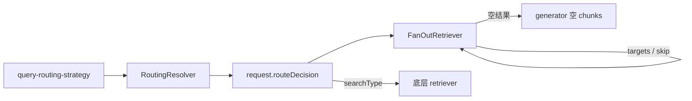

# Query Routing 语义升级 — 实施方案

> 状态：**已落地**
> 日期：2026-08-19
> 前置：[query-routing-semantics.md](./query-routing-semantics.md)
> 范围：`packages/runtime` + pgvector retriever 消费 `searchType`

---

## 目标

pre-retrieval 产出结构化 `RouteDecision`，retrieval **必须读取并改变检索路径**（去哪检索 / 怎么检索 / 是否跳过）。`request.route` 保留为 debug，不是选路键。pipeline 保持单条，不引入 RoutingRetriever。



---

## 做 / 不做

做：`RouteDecision`；LLM / 规则 resolver；FanOut 消费 `targets` / `skip`；pgvector 按 `searchType` 切换召回；`run-runtime` 接线 `retrievalSkipped`；观测与 passthrough 纳入决策。

不做：`iterative` / Active RAG / 第二查询路径；按 route 选 generator；Semantic / embedding 路由实现；拆 `run-runtime.ts`；删 `request.route`；改 `apps/`、eval / utils；改 generator 拒答。

---

## 1. 类型

新建 `packages/runtime/src/types/route-decision.ts`，从 `types/index.ts` 导出。

`searchType` 使用已有 `RuntimeRetrieverSearchType`（`vector` | `keyword` | `hybrid`）。不要新增 dense/sparse，不要把 `iterative` 写进公开类型。

```typescript
import type { RuntimeRetrieverSearchType } from '../stages/retrieval/runtime-retriever.js';

export type RouteRetrievalMode = 'skip' | 'single';

export type RouteDecision = {
  /** 匹配子 retriever 的 `id`。缺省：不按目标过滤。 */
  targets?: string[];
  /** 缺省视为 `single`。 */
  retrievalMode?: RouteRetrievalMode;
  /** 必须改变召回形态（由声明了对应能力的 retriever 执行）。 */
  searchType?: RuntimeRetrieverSearchType;
};
```

`RetrievalRequest` 增加 `routeDecision?: RouteDecision`。保留 `route?: string`。JSDoc：行为以 `routeDecision` 为准。

route → retriever 映射放在 resolver（规则命中，或 LLM 的 `availableTargets`），retrieval 不再维护第二份 `{ factual: retrieverA }` 表。

---

## 2. RoutingResolver

目录：`packages/runtime/src/stages/pre-retrieval/strategies/routing/`。

```typescript
export type RoutingResolveResult = {
  decision?: RouteDecision;
  /** debug；缺省可由 strategy 填 `decision.targets?.[0]` */
  route?: string;
  budget?: RetrievalBudget;
  filters?: RetrievalFilters;
};

export interface RoutingResolver {
  resolve(
    query: string,
    request: RetrievalRequest,
    context: RuntimeContext,
  ): Promise<RoutingResolveResult | undefined>;
}

export type RoutingRule = {
  name: string;
  match: (query: string, request: RetrievalRequest) => boolean;
  decision: RouteDecision;
};
```

**LlmRoutingResolver**：迁入现有 LLM 调用与 JSON 解析。prompt 增加 `targets` / `retrievalMode` / `searchType`，保留 `topK` / `budget` / `filters`。`topK` 只写 `budget.maxChunks`，不写 `request.topK`。构造：`RuntimeStrategyModel` + `availableTargets`（写入 prompt；内核不校验 id）。无法识别的 `searchType` / `retrievalMode`：丢弃该字段；`onError: 'throw'` 时才整单失败。

**RuleBasedRoutingResolver**：按规则数组顺序，命中即返回。

不实现第三种（embedding）resolver。

---

## 3. query-routing-strategy

文件：`packages/runtime/src/stages/pre-retrieval/strategies/query-routing-strategy.ts`。

- 注入 `resolver: RoutingResolver`。
- `apply()`：写入 `routeDecision`；可选写 `route` / `budget` / `filters`；有决策才写 `rewriteReason: 'query-routing'`。
- 无 decision 且无可用 route：透传，不写 `rewriteReason`。
- 工厂：`createLlmRoutingStrategy` / `createRuleBasedRoutingStrategy`。
- `createQueryRoutingStrategy`：`@deprecated`，有 `model` 无 `resolver` 时内部创建 `LlmRoutingResolver`。
- `isQueryStrategyPassthrough` 比较 `routeDecision`。

---

## 4. FanOut 消费 targets / skip

文件：`packages/runtime/src/stages/retrieval/fan-out-retriever.ts`。`searchType` 原样下传，FanOut 不改融合算法。

官方路径：`createRuntimeFromConfig` 默认包一层 FanOut。多库时调用方传入 `FanOutRetriever({ retrievers })` 并为每个子 retriever 设 `id`。

| 条件 | 行为 |
| --- | --- |
| 无 `routeDecision` | 行为不变（无 `subQueries` 时仍只调 `#retrievers[0]`） |
| `retrievalMode === 'skip'` 或 `targets: []` | 不调子 retriever；`candidates: []`；`retrievalMetadata.skipped: true` |
| `targets` 非空 | 按 `id` 过滤；单查询也召回全部匹配目标，不短路成 `[0]` |
| `targets` 非空且无一匹配 | 同 skip；打 observation；禁止回退 `[0]` |

---

## 5. 底层 retriever 消费 searchType

**pgvector**（`packages/adapters/src/pgvector/retrievers/pg-vector-runtime-retriever-adapter.ts`）：

- `vector`：只跑 `#retrieveByEmbedding`
- `keyword`：只跑 `#retrieveByKeyword`
- 缺省或 `hybrid`：保持现有双路 RRF
- `capabilities.searchTypes` 声明 `['vector', 'keyword', 'hybrid']`
- 单路结果的 `scoreKind` 为 `retriever`；双路融合仍为 `rrf`

**langchain**：无双路则不切换。请求的 `searchType` 不在 `capabilities` 内时按现有单路执行，不要假装已切换。

---

## 6. skip → grounding

`buildRuntimeGeneratorInput`（`run` / `runStream` 共用）传入：

```ts
retrievalSkipped:
  request.routeDecision?.retrievalMode === 'skip' ||
  retrievalResult.retrievalMetadata?.skipped === true
```

空 chunks 时内置 generator 仍生成。不拆 `run-runtime.ts`，不改拒答。`runtime.search()` 不需要 grounding，skip 表现为 0 条候选。

---

## 7. 观测

`queryIntentSnapshot`：有 `routeDecision` 则写入 attributes。FanOut 在 skip / 无匹配 targets 时，事件不得表现成「已检索但库空」。

---

## 8. 导出、注释、测试

包根导出新类型、resolver、两个工厂。`exports.spec.ts` 为新符号加 `toBeDefined()`，不改 src/dist 键集合的 `toEqual` 语义。

公开类型与 skip / 无匹配 targets / pgvector 按 searchType 分路的控制流写简体中文注释（为什么，不复述标识符）。

测试至少覆盖：

- 规则 skip：不调子 retrieve；`grounding.chunksEmptyReason === 'skipped'`
- `targets: ['b']` 只调 `id === 'b'`
- 无匹配 targets 不调 `[0]`
- 无 `routeDecision` 行为不变
- `createQueryRoutingStrategy` 仍能写 `route` 与 budget
- 只写 `routeDecision` 不算 passthrough
- pgvector `searchType: 'vector'` 不跑 keyword SQL

```powershell
pnpm --filter @monai-ragsdk/runtime build
pnpm --filter @monai-ragsdk/runtime test
pnpm --filter @monai-ragsdk/adapters test
```

改 adapters 前先 build runtime。

---

## 边界

- 不配 routing 策略则无 `routeDecision`，retriever 行为不变。
- 不改默认 post-retrieval 顺序，不改「单 retriever 再包一层 FanOut」。
