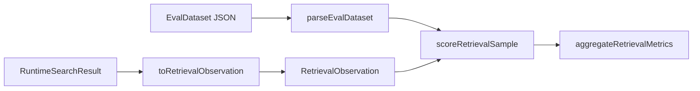
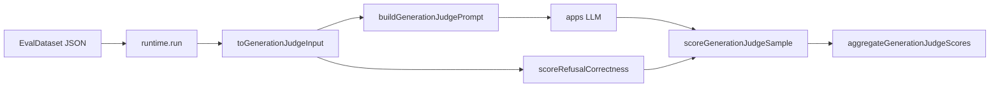
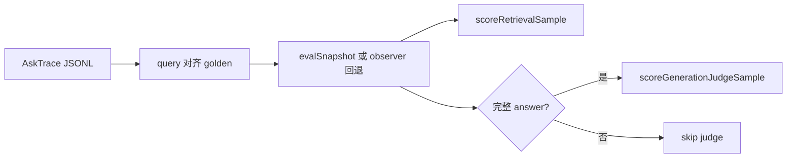
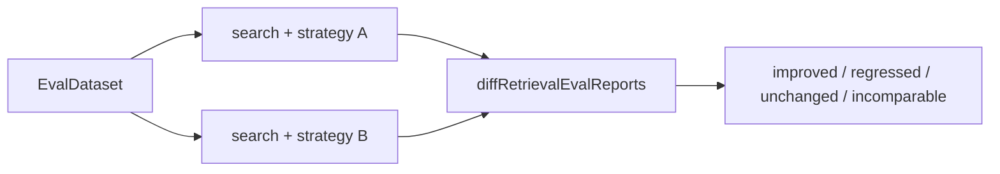

# RAG Eval — 评测体系架构

> 状态：**已落地（检索跑分 + 回归 diff + 生成 judge + 在线抽样 + Web 评测页）**
> 日期：2026-08-24
> 范围：`packages/eval` 契约 / 指标 / diff / judge 协议；`apps/server` harness；`apps/web` `/eval`
> 关联：[eval.md](../packages/eval.md) · [eval-handoff.md](../context/eval-handoff.md) · [routing.md](../packages/routing.md) · [observability.md](../packages/observability.md) · [runtime.md](../packages/runtime.md)

---

## 背景

策略调参、版本回归与上线后抽样评审需要统一的 golden 契约、可复用指标与可对比报告。评测逻辑集中在 `@monai-ragsdk/eval`（纯算子）与 `apps/server`（跑分 harness），避免散落到 runtime 或未命名模块。

---

## 决策

**eval 为零 workspace 依赖的纯评测算子包。**

- eval **不** import `RAGResponse` / `RAGTrace` / `Runtime`；自带中性输入契约（`EvalDataset`、`RetrievalObservation`、`GenerationJudgeInput`）
- 跑 pipeline、读 JSONL、调 LLM judge 留在 **apps 层**（server / web / example）；apps 写 mapper 把内核产物翻译成 eval 契约
- 允许 npm 依赖 `zod`（与 `core` 一致）；**禁止** workspace 包依赖，保持叶子地位
- golden 标注粒度为 **source/文档级**（`relevantSourceIds`），对齐 `RAGRetrievedCandidate.sourceId` / `RAGCitation.sourceId`；重切分 chunk 不失效

### 单次跑分

### 生成 judge

### 在线抽样

### 回归对比

---

## 语义矩阵

| 条件 | 行为 |
| --- | --- |
| 候选均有 `sourceId` | 正常计 recall / precision / hitRate / MRR / nDCG@k |
| 部分候选缺 `sourceId` | 仅对有 `sourceId` 的候选建 rank；产出 `coverage`；**缺 sourceId 的候选不计为 miss** |
| 全部候选缺 `sourceId` | 样本标 `unscorable: true`；聚合时从分母剔除，报告单列 |
| 同一 source 多 chunk | 按首次出现 rank 去重 |
| `retrieved` vs `selected` | 召回层 vs 入 prompt 层；`layer` 参数选择 |
| compare verdict | 先看 MRR delta；持平时看 `recall@primaryK`；任一侧 unscorable → `incomparable` |
| 生成 judge | LLM 只打 faithfulness / relevance（0–1）；refusalCorrectness 由 `expectedRefusal` 与观测 `refused` 比对；无上下文时 faithfulness 为 `null`；三维皆空 → `unscorable` |
| 在线抽样 | 按 `query` 对齐 `AskTrace`；检索优先 `evalSnapshot`；无快照则 observer 回退（通常缺 sourceId → unscorable）；无完整 answer 则跳过 judge，不用 `answerPreview` |

---

## 已落地范围

**packages/eval**

- `EvalSample` / `EvalDataset` / `RetrievalObservation` + `parseEvalDataset`
- source 级指标与 `scoreRetrievalSample` / `aggregateRetrievalMetrics`
- `diffRetrievalEvalReports` / `compareRetrievalSampleDiff`
- 生成 judge：`GenerationJudgeInput` / prompt 模板 / `scoreGenerationJudgeSample` / `aggregateGenerationJudgeScores`（**不**内嵌 LLM）
- vitest 单测

**apps/server**

- `toRetrievalObservation`、`runRetrievalEval`、`runRetrievalEvalCompare`
- `toGenerationJudgeInput`、`runGenerationJudge`（`runtime.run` + strategyModel 注入）
- `toAskEvalSnapshot`、`runEvalFromTraces`（ask 落盘完整 answer；旧轨迹无快照则跳过 judge）
- `searchGlobal(..., strategyOverride?)` / `runGlobal(..., strategyOverride?)`（临时策略，不改持久化全局策略）
- `POST /api/v1/eval/run`、`POST /api/v1/eval/compare`、`POST /api/v1/eval/judge`、`POST /api/v1/eval/from-traces`

**apps/web**

- 管理员侧栏「评测」→ `/eval`：粘贴 / 上传 golden，跑 run / compare / judge / from-traces

**未做**

内核缺口见下表。不把 observer `sourceId` / 完整 answer 写成已可用。

---

## 做 / 不做（包边界）

**做：**

- 纯函数指标、golden 解析、diff
- 显式 `unscorable` 与 `coverage`
- 生成 judge 协议、prompt 模板、LLM 输出解析与聚合

**不做：**

- eval 内编译 runtime、批量 ask、读 `node:fs`
- eval 内嵌 LLM judge
- 把评测逻辑写进 runtime / observability / adapters

---

## 内核缺口（改前单独开决策）

| 缺口 | 影响 |
| --- | --- |
| `scoreKind` 不在 `RAGRetrievedCandidateSchema` | API 返回无法判分数口径；trace `attributes.candidates` 有 |
| `finalizeTrace` 不写 `sampleId` / `dataset` / `version` | trace 与 golden 需靠 `tags` 或 apps 关联 |
| trace `attributes.candidates` 无 `sourceId` | 纯 trace 评测需 chunk→source 映射 |
| trace 仅 `answerPreview`（200 字） | 生成 judge 须 `RuntimeResult.answer` |
| `Chunk` schema 无强制 `documentId` | source 对齐依赖 ingest 写 `metadata.sourceId` |

---

## 关联

- 包现状：[eval.md](../packages/eval.md)
- 对接与下一刀：[eval-handoff.md](../context/eval-handoff.md)
- REST：[api.md](../server/api.md)
- runtime 审计：[runtime.md](../packages/runtime.md) §4
