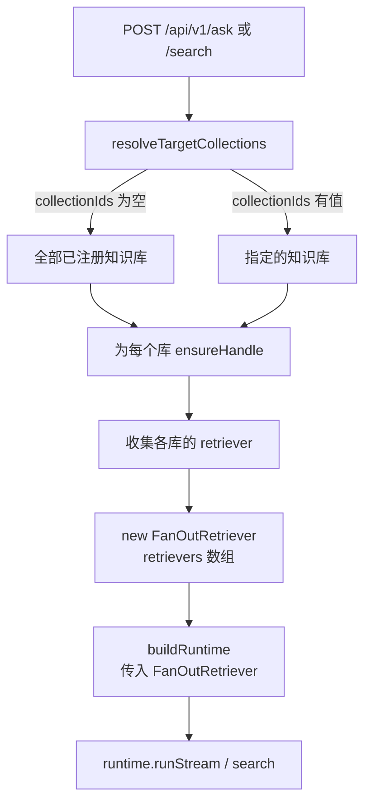

# Server API 重设计

> 状态：**草案**
> 日期：2026-08-19
> 范围：`apps/server` API 层
> 关联：Query Routing 内核语义偏移问题（独立议题，见末尾说明）

---

## 背景与问题

当前 `apps/server` 的 API 设计存在两个结构性问题：

### 问题 1：ask / search 强绑单个知识库

现有接口：

```
POST /api/v1/collections/:id/ask
POST /api/v1/collections/:id/search
```

用户在发起查询前必须显式指定知识库 ID。这把"去哪里检索"的决策完全推给了调用方，而在 RAG 系统中，这本应是**检索前处理**（pre-retrieval）阶段——特别是 Query Routing——的职责。

实际场景中，用户往往不清楚自己的问题应该查哪个库，或者答案可能横跨多个库。强绑单库的设计：

- 限制了跨库检索能力
- 前端必须在 UI 层实现"选库"交互，增加用户认知负担
- 与 RAG 领域"Query Routing 自动决定检索源"的标准实践相悖

### 问题 2：ingest 切分策略硬编码

当前 `apps/server/src/services/collection-registry.ts` 中 `ensureHandle()` 的 indexing 配置：

```typescript
const indexingBase: Omit<IndexingOptions, 'loader'> = {
  chunker: new SimpleChunker({ chunkSize: 500, overlap: 50 }),
  // ...
};
```

`chunkSize=500`、`overlap=50` 完全硬编码，用户无法根据文档类型、长度、领域特征调整切分策略。不同文档（长篇技术文档 vs 短 FAQ vs 结构化 Markdown）适合的切分粒度差异很大，一刀切会显著影响检索质量。

同时，`Loader` 层虽然 SDK 已预留接口（`packages/indexing/src/loaders/loader.ts`），但 server 层没有任何 loader 选择或推荐机制。

---

## SDK 层能力现状

在制定 server 改造方案前，先确认 SDK 内核已具备的能力，**本次改造不涉及 SDK 层变更**。

### FanOutRetriever（多路检索 + RRF 融合）

`packages/runtime/src/stages/retrieval/fan-out-retriever.ts`：

```typescript
export type FanOutRetrieverOptions = {
  retriever: RuntimeRetriever;
  retrievers?: RuntimeRetriever[];   // 支持多个 retriever
  fuse?: (...) => RetrievalCandidate[];
  maxConcurrency?: number;
  rrf?: FuseByReciprocalRankFusionOptions;
};
```

- 已支持传入 `retrievers: RuntimeRetriever[]`，对每个子查询并发调用全部 retriever，用 RRF 融合结果
- 无 subQueries 时退化为单 retriever 单次检索
- `RuntimeRetriever` 接口极简（单方法 `retrieve(request, context)`），任何满足签名的对象均可接入

**结论**：server 层只需为每个目标知识库构建各自的 `PgVectorRuntimeRetrieverAdapter`，用 `FanOutRetriever` 包装即可实现多库并发检索。

### createQueryRoutingStrategy（语义路由标签）

`packages/runtime/src/stages/pre-retrieval/strategies/query-routing-strategy.ts`：

- 用 LLM 生成 `request.route`（字符串标签，如 `conceptual` / `factual`）
- 可选输出 `topK`、`budget`、`filters`
- **不负责选择 retriever 或知识库**——只给 request 打标签

**结论**：当前 Query Routing 做的是"查询类型分类"，不是"检索源选择"。这个职责划分在本次 server API 改造中是合理的（server 层自行处理库级路由），但其语义是否偏移了 Query Routing 的标准定义，需要另开文档讨论。

### Chunker / Loader

- `SimpleChunker`：唯一的切分器实现，参数为 `chunkSize` / `overlap`（固定字符窗口滑动）
- `Loader`：仅有接口定义（`packages/indexing/src/loaders/loader.ts`），无内置实现
- `IndexingOptions.chunker` 是可选字段，可以在每次 ingest 时传入不同实例

**结论**：server 层可以按用户参数动态构建 `SimpleChunker`，不需要改 SDK。Loader 推荐目前只能做信息性提示。

---

## 决策 1：全局 ask / search

### 新增路由

```
POST /api/v1/ask          — 全局流式问答（SSE）
POST /api/v1/search       — 全局检索
```

旧的 `/api/v1/collections/:id/ask` 和 `/api/v1/collections/:id/search` 暂时保留，确保现有前端（`apps/web`）不被破坏。

### 请求体

```typescript
// POST /api/v1/ask
{
  question: string;
  collectionIds?: string[];   // 可选；不传 = 跨全部已注册知识库
}

// POST /api/v1/search
{
  query: string;
  topK?: number;
  collectionIds?: string[];   // 同上
}
```

### 实现路径



核心新增函数：

- `buildGlobalRuntime(collectionIds?: string[])`：在 `collection-registry.ts` 中实现
  - 对每个目标库调 `ensureHandle(id)` 拿到各自的 `PgVectorRuntimeRetrieverAdapter`
  - 用 `new FanOutRetriever({ retrievers: [...] })` 包装
  - 调 `buildRuntime(...)` 组装完整 runtime

### 全局策略

跨多库时，每个库可能有不同的 `StrategyConfig`（pre-retrieval / post-retrieval 开关不同）。方案：

- 新增一个"全局默认策略"（类似 `defaultStrategy('global')`），作为跨库 ask/search 的基准策略
- 用户后续可通过 `PUT /api/v1/strategy`（不带 collectionId）配置全局策略
- 单库 ask（旧接口）仍用该库自己的 strategy，行为不变

### SSE 逻辑复用

当前 SSE 流式问答逻辑写死在 `routes/documents.ts` 的 `/ask` 路由里。改造时需要：

- 将 SSE 写入 + trace 记录逻辑提取为共享函数
- 全局 `/api/v1/ask` 和单库 `/api/v1/collections/:id/ask` 共用该函数

---

## 决策 2：ingest 可配置化

### 请求体扩展

在 `POST /api/v1/collections/:id/ingest` 的请求体中新增可选的 `chunking` 字段：

```typescript
{
  documents: IngestDocumentInput[];
  mode?: IngestMode;
  chunking?: {
    chunkSize?: number;    // 默认 500
    overlap?: number;      // 默认 50
  };
}
```

- `chunking` 不传时使用现有默认值（向后兼容）
- 传入时用参数动态构建 `SimpleChunker` 实例，不再使用 `ensureHandle` 中硬编码的默认 chunker

### Loader 推荐接口

当前 ingest 只接受纯文本 JSON（`content` 字段），不涉及真实文件上传/解析。Loader 推荐分两期：

**本期（信息性）**：新增只读推荐接口

```
POST /api/v1/collections/:id/ingest/recommend
```

请求体：

```typescript
{
  documents: Array<{ id?: string; metadata?: { title?: string } }>;
}
```

响应：

```typescript
{
  chunking: { chunkSize: number; overlap: number };
  loaderHint: string;   // 如 "text/plain", "text/markdown"
  mode: IngestMode;
}
```

根据文档 metadata 中的文件扩展名（`.md` / `.txt` / `.pdf` 等）返回推荐配置。前端可展示推荐值供用户确认/调整。

**后续期**：当 `packages/indexing` 有真实 Loader 实现（FileLoader、MarkdownLoader 等）后，server 层按推荐自动选择 loader，ingest 接口可接受文件上传。

---

## 预期文件变更清单

> 仅列出预期变更范围，本文档不执行具体代码改动。

| 文件 | 操作 |
| --- | --- |
| `apps/server/src/routes/ask.ts` | 新建：全局 ask 路由（SSE） |
| `apps/server/src/routes/search.ts` | 新建：全局 search 路由 |
| `apps/server/src/routes/documents.ts` | 保留旧 ask/search（兼容）；提取 SSE 逻辑为共享函数 |
| `apps/server/src/services/collection-registry.ts` | 新增 `buildGlobalRuntime`；`ingestDocuments` 接受 `chunking` 参数 |
| `apps/server/src/services/pipeline-factory.ts` | 无改动（`buildRuntime` 已支持传入任意 `RuntimeRetriever`） |
| `apps/server/src/app.ts` | 挂载新路由 |
| `apps/server/src/types/api.ts` | 新增 `ChunkingConfig` / `IngestRecommendation` 等类型 |
| `docs/server/api.md` | 补充新接口文档 |

---

## 不做的事

- 不改 SDK 层（`packages/runtime` / `packages/indexing` / `packages/adapters`）
- 不改前端（`apps/web`）—— 旧接口保留兼容
- 不新增 Loader 实现（`packages/indexing` 当前只有接口）
- 不实现"按语义 route 标签自动选库"的路由（这依赖 Query Routing 内核语义的重新定义，见下节）
- 不在本次改造中引入新依赖

---

## 与 Query Routing 内核偏移问题的关系

当前 `createQueryRoutingStrategy`（`packages/runtime/src/stages/pre-retrieval/strategies/query-routing-strategy.ts`）的行为是：

- 用 LLM 根据问题生成一个 `route` 字符串标签（如 `conceptual` / `factual`）
- 可选输出 `topK` / `budget` / `filters`
- 标签写入 `request.route`，供下游 retriever / postprocessor 读取

在 RAG 领域的标准定义中，**Query Routing** 通常指"根据查询特征选择不同的检索源/索引/知识库"，而不仅仅是打一个语义分类标签。当前实现更接近"Query Classification"或"Intent Detection"。

这个偏移影响：

- 当前 server 的全局 ask/search 改造不依赖 Query Routing 做库级分发（server 层自行处理），所以本次改造不受阻
- 但如果后续要实现"LLM 自动决定查哪些库"，则需要重新审视 Query Routing 的职责定义

**建议**：Query Routing 内核语义问题作为独立决策文档另行讨论，文件建议为 `docs/decisions/query-routing-semantics.md`。
