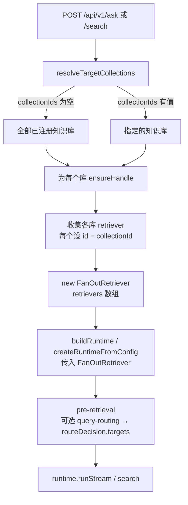

# Server API 重设计

> 状态：**server 已落地**（2026-08-20）；web 待跟进 [web-followup.md](../server/web-followup.md)
> 日期：2026-08-20（内核快照对齐 [routing.md](../packages/routing.md)）
> 范围：`apps/server` API 层 + `apps/web` 问答 / 检索 / 策略页（破坏性同期改造）
> 关联：Query Routing 内核升级（[query-routing-upgrade.md](./query-routing-upgrade.md)，**已落地**）；语义归档（[query-routing-semantics.md](./query-routing-semantics.md)）

---

## 背景与问题

当前 `apps/server` 的 API 设计存在两个结构性问题：

### 问题 1：ask / search 强绑单个知识库

现有接口：

```
POST /api/v1/collections/:id/ask
POST /api/v1/collections/:id/search
```

用户在发起查询前必须显式指定知识库 ID。这把"去哪里检索"的决策完全推给了调用方，而在 RAG 系统中，这本应是**检索前处理**（pre-retrieval）阶段——特别是 Query Routing——的职责。

实际场景中，用户往往不清楚自己的问题应该查哪个库，或者答案可能横跨多个库。强绑单库的设计：

- 限制了跨库检索能力
- 前端必须在 UI 层实现"选库"交互，增加用户认知负担
- 与 RAG 领域"Query Routing 自动决定检索源"的标准实践相悖

**前端同样绑死在旧模型上**：`apps/web` 以「先选知识库再提问」为主路径，API client、路由与页面状态都假设 ask/search 挂在 `/collections/:id` 下。继续保留旧接口只会固化这套交互，与 server 全局化方向冲突。**本次采用破坏性变更**：删除单库 ask/search，server 与 web 同期改造。

### 问题 2：ingest 切分策略硬编码

当前 `apps/server/src/services/collection-registry.ts` 中 `ensureHandle()` 的 indexing 配置：

```typescript
const indexingBase: Omit<IndexingOptions, 'loader'> = {
  chunker: new SimpleChunker({ chunkSize: 500, overlap: 50 }),
  // ...
};
```

`chunkSize=500`、`overlap=50` 完全硬编码，用户无法根据文档类型、长度、领域特征调整切分策略。不同文档（长篇技术文档 vs 短 FAQ vs 结构化 Markdown）适合的切分粒度差异很大，一刀切会显著影响检索质量。

同时，内核与 adapters 已提供多种 Chunker / Loader，但 server 层没有任何选择或推荐机制，仍固定 `SimpleChunker` + 纯文本 JSON ingest。

---

## SDK 层能力现状（2026-08-20）

在制定 server 改造方案前，先确认 SDK 内核**当前**已具备的能力。**本次 server 改造仍不强制改 SDK**，但设计应利用已落地能力，避免重复发明。

内核快照详见 [routing.md](../packages/routing.md) 及各包页（[indexing](../packages/indexing.md) / [runtime](../packages/runtime.md) / [adapters](../packages/adapters.md)）。

### FanOutRetriever（多路检索 + RRF 融合 + routeDecision 消费）

`packages/runtime/src/stages/retrieval/fan-out-retriever.ts`：

```typescript
export type FanOutRetrieverOptions = {
  retriever: RuntimeRetriever;
  retrievers?: RuntimeRetriever[];   // 支持多个 retriever
  fuse?: (...) => RetrievalCandidate[];
  maxConcurrency?: number;
  rrf?: FuseByReciprocalRankFusionOptions;
};
```

当前行为（[runtime.md](../packages/runtime.md) §4.2；实现见 [query-routing-upgrade.md](./query-routing-upgrade.md)）：

- 读 `subQueries`：对每个子查询并发调用全部（或 targets 过滤后的）retriever，RRF 融合
- 读 `routeDecision.targets`：按子 retriever 的 `id` 过滤；**无匹配时不回退 `[0]`**，等同 skip
- 读 `routeDecision.retrievalMode === 'skip'` 或 `targets: []`：不调子 retriever，`retrievalMetadata.skipped: true`
- 无 `subQueries` 且无 `routeDecision.targets` 时退化为只调 `#retrievers[0]`
- `RuntimeRetriever` 可选 `id` / `name` / `capabilities.searchTypes` / `close()`

**结论**：server 为每个目标知识库构建 `PgVectorRuntimeRetrieverAdapter` 并设 `id`（建议用 collectionId），用 `FanOutRetriever({ retrievers: [...] })` 包装即可实现多库并发检索；若启用 query-routing 且 resolver 产出 `targets`，内核可进一步按 id 选库，无需 server 再写一套分发逻辑。

### Query Routing（routeDecision 已落地）

[query-routing-upgrade.md](./query-routing-upgrade.md) **已落地**。`query-routing` 策略经 `RoutingResolver` 写出结构化 `request.routeDecision`：

| 字段                                             | 含义                     | 消费方                                                         |
| ------------------------------------------------ | ------------------------ | -------------------------------------------------------------- |
| `targets?: string[]`                             | 匹配子 retriever 的 `id` | FanOut 过滤召回目标                                            |
| `retrievalMode?: 'skip' \| 'single'`             | 是否跳过检索             | FanOut；generation 写 `grounding.chunksEmptyReason: 'skipped'` |
| `searchType?: 'vector' \| 'keyword' \| 'hybrid'` | 召回形态                 | pgvector adapter 切换向量 / 关键词 / 双路 RRF                  |

附加产出仍保留：`budget` / `filters`；`request.route` 仅为 debug，**不是**选路键。

工厂：`createLlmRoutingStrategy` / `createRuleBasedRoutingStrategy`；`createQueryRoutingStrategy` 仍可用（内部走 `LlmRoutingResolver`）。

**结论**：

- 单库场景：routing 可切换 pgvector 的 dense / sparse / hybrid，或 skip 检索
- 多库场景：若各库 retriever 设了 `id`，routing 的 `targets` 可实现**库级选路**——前提是 server 在 resolver 的 `availableTargets` 中注册 collection id，并在 FanOut 中挂载对应 retriever
- server 当前 `pipeline-factory.ts` 仍手拼策略且 post 顺序与官方 `createRuntimeFromConfig` 不一致（rerank 在 threshold 之后）；全局 ask/search 改造时建议评估是否迁到 `createRuntimeFromConfig`，但不在本文档强制范围

### Chunker / Loader / 装配入口

**indexing 内置**（[indexing.md](../packages/indexing.md) §4）：

| 角色             | 内置实现                                                                      |
| ---------------- | ----------------------------------------------------------------------------- |
| Chunker          | `SimpleChunker`（默认 500 / 50）、`HeadingBasedChunker`、`ParentChildChunker` |
| ChunkTransformer | `ContextualHeaderTransformer`                                                 |
| Loader           | **无**（仅契约：`packages/indexing/src/stages/load/loader.ts`）               |

**adapters LangChain**（[adapters.md](../packages/adapters.md) §5）——应用层接入，indexing 不重复实现：

- Loader：directory、markdown directory、PDF、Web URL、Cheerio HTML、通用 loader adapter
- Chunker：recursive character、markdown、token、semantic、language（代码感知）、sentence + presets

`IndexingOptions.chunker` 为可选字段，每次 ingest 可传入不同 Chunker 实例（内核或 adapters 适配器均可）。

**结论**：

- server 层可按用户参数动态构建 `SimpleChunker`（最小改动），或按文档类型推荐 / 选用 `HeadingBasedChunker`、`ParentChildChunker` 或 adapters LangChain chunker——**均不需要改 indexing 内核**
- Loader 真实实现已在 adapters；server ingest 若从纯文本 JSON 扩展到文件路径 / 上传，应通过 adapters 接入，而非在 server 内重写解析

### createRuntimeFromConfig（官方推荐装配）

`createRuntimeFromConfig()` 为 runtime 官方装配入口：默认包一层 FanOut、官方 post-retrieval 顺序（`llm-rerank → score-threshold → …`）。server 当前仍用 `buildRuntime()` 手拼；Wiki 建议改 server 时优先对齐此 API（[routing.md](../packages/routing.md) 横切事实 §3）。

---

## 决策 1：全局 ask / search（破坏性变更）

### 路由

**唯一**问答 / 检索入口：

```
POST /api/v1/ask          — 流式问答（SSE）
POST /api/v1/search       — 检索
```

**删除**（不再提供兼容层）：

```
POST /api/v1/collections/:id/ask      — 移除
POST /api/v1/collections/:id/search   — 移除
```

单库场景通过请求体 `collectionIds: [id]` 表达，不再从 URL path 绑定知识库。旧 path 请求应返回 `404` 或明确的 `410 Gone`（实现时二选一并在 API 文档写明）。

### 请求体

```typescript
// POST /api/v1/ask
{
  question: string;
  collectionIds?: string[];   // 可选；不传 = 跨全部已注册知识库
}

// POST /api/v1/search
{
  query: string;
  topK?: number;
  collectionIds?: string[];   // 同上
}
```

### 实现路径



核心新增函数：

- `buildGlobalRuntime(collectionIds?: string[])`：在 `collection-registry.ts` 中实现
  - 对每个目标库调 `ensureHandle(id)` 拿到各自的 `PgVectorRuntimeRetrieverAdapter`
  - **为每个 retriever 设置 `id: collectionId`**，以便 FanOut / query-routing 的 `targets` 能按库过滤
  - 用 `new FanOutRetriever({ retrievers: [...] })` 包装
  - 调 `buildRuntime(...)`（或后续迁到 `createRuntimeFromConfig`）组装完整 runtime

### 策略模型

ask / search 统一走**全局策略**；不再按 URL 中的 collectionId 加载 per-collection strategy。

- 新增 `defaultStrategy('global')`，作为 `/api/v1/ask` 与 `/api/v1/search` 的唯一策略来源
- 用户通过 `PUT /api/v1/strategy`（不带 collectionId）配置全局策略
- 各知识库仍可保留独立的 ingest / 文档管理配置；**仅查询链路**不再分叉 per-collection strategy（避免多库 FanOut 时策略语义不清）

启用全局 routing 时，resolver 的 `availableTargets` 应列出当前 FanOut 中各 retriever 的 `id`（即 collectionId），LLM 方可产出有意义的 `routeDecision.targets`。

### 前端配套改造（`apps/web`）

与 server 同期交付，不另开兼容期：

| 现状                            | 目标                                                    |
| ------------------------------- | ------------------------------------------------------- |
| 必须先进入某 collection 再 ask  | 默认全局问答；`collectionIds` 为可选收窄范围            |
| API 调用 `/collections/:id/ask` | 改为 `POST /api/v1/ask`，必要时 body 传 `collectionIds` |
| 选库作为主路径 UI               | 降为高级选项 / 筛选器，或交给 routing 自动选库          |
| 策略页绑定单库                  | 对齐全局 `PUT /api/v1/strategy`                         |

### SSE 实现

当前 SSE 逻辑写在 `routes/documents.ts` 的旧 `/ask` 路由里。改造时：

- 将 SSE 写入 + trace 记录提取为共享函数（如 `services/ask-stream.ts`）
- 仅 `/api/v1/ask` 消费；从 `documents.ts` 移除 ask/search 路由

---

## 决策 2：ingest 可配置化

### 请求体扩展

在 `POST /api/v1/collections/:id/ingest` 的请求体中新增可选的 `chunking` 字段：

```typescript
{
  documents: IngestDocumentInput[];
  mode?: IngestMode;
  chunking?: {
    strategy?: 'fixed' | 'heading' | 'parent-child';  // 默认 'fixed'
    chunkSize?: number;    // strategy='fixed' 时默认 500
    overlap?: number;      // strategy='fixed' 时默认 50
  };
}
```

- `chunking` 不传时使用现有默认值（`SimpleChunker` 500 / 50，向后兼容）
- `strategy: 'fixed'`：动态构建 `SimpleChunker`
- `strategy: 'heading'`：使用 indexing 内置 `HeadingBasedChunker`（适合 Markdown / 标题结构文档）
- `strategy: 'parent-child'`：使用 `ParentChildChunker`（section 为 parent，段内再切 child）
- LangChain 切分器（recursive / markdown / token / semantic 等）可作为**后续 server 扩展**：通过 adapters 接入，本期可不暴露全部 preset

### Loader 推荐接口

当前 ingest 只接受纯文本 JSON（`content` 字段），不涉及真实文件上传/解析。Loader 推荐分两期：

**本期（信息性）**：新增只读推荐接口

```
POST /api/v1/collections/:id/ingest/recommend
```

请求体：

```typescript
{
  documents: Array<{ id?: string; metadata?: { title?: string; mimeType?: string } }>;
}
```

响应：

```typescript
{
  chunking: {
    strategy: 'fixed' | 'heading' | 'parent-child';
    chunkSize?: number;
    overlap?: number;
  };
  loaderHint: string;   // 如 "text/plain", "text/markdown", "application/pdf"
  mode: IngestMode;
}
```

根据文档 metadata 中的扩展名 / mimeType（`.md` / `.txt` / `.pdf` 等）返回推荐配置。例如 Markdown 推荐 `strategy: 'heading'` 或 `parent-child`；纯文本推荐 `fixed`。前端可展示推荐值供用户确认/调整。

**后续期**：ingest 接受文件路径或上传时，按推荐选用 [adapters LangChain Loader](../packages/adapters.md)（PDF / Web / directory 等），不再在 server 内实现解析逻辑。

---

## 预期文件变更清单

> 仅列出预期变更范围，本文档不执行具体代码改动。

| 文件                                               | 操作                                                                                 |
| -------------------------------------------------- | ------------------------------------------------------------------------------------ |
| `apps/server/src/routes/ask.ts`                    | 新建：`POST /api/v1/ask`（SSE）                                                      |
| `apps/server/src/routes/search.ts`                 | 新建：`POST /api/v1/search`                                                          |
| `apps/server/src/routes/documents.ts`              | **删除** ask/search 路由；ingest 等文档接口保留                                      |
| `apps/server/src/services/ask-stream.ts`（或同等） | 从 documents 提取 SSE + trace 共享逻辑                                               |
| `apps/server/src/services/collection-registry.ts`  | 新增 `buildGlobalRuntime`；retriever 设 `id`；`ingestDocuments` 接受 `chunking` 参数 |
| `apps/server/src/services/pipeline-factory.ts`     | 可选：评估迁到 `createRuntimeFromConfig`；本次至少保证 FanOut 多 retriever 可传入    |
| `apps/server/src/app.ts`                           | 挂载新路由；移除旧 ask/search 挂载                                                   |
| `apps/server/src/types/api.ts`                     | 新增 `ChunkingConfig` / `IngestRecommendation` 等类型                                |
| `apps/web/**`                                      | API client、问答页、策略页对齐全局接口（破坏性）                                     |
| `docs/server/api.md`                               | 新接口文档；标注已删除的旧 path                                                      |

---

## 不做的事

- 不改 SDK 层契约（`packages/runtime` / `packages/indexing` / `packages/adapters` 现有公开 API）
- 不提供旧 ask/search path 的兼容层、适配器或 deprecation 双轨期
- 不在 server 内新增 Loader / Chunker 实现（解析与 LangChain 切分走 adapters；结构切分用 indexing 内置）
- 不在本次改造中实现完整文件上传管线（推荐接口 + 可配置 chunking 为先；Loader 自动选择留后续期）
- 不在本次改造中强制迁移 `pipeline-factory` 到 `createRuntimeFromConfig`（建议项，非阻塞）
- 不在本次改造中引入新 npm 依赖

---

## 与 Query Routing 内核升级的关系

2026-08-19 起，内核已完成 Query Routing 语义升级（[query-routing-upgrade.md](./query-routing-upgrade.md)，状态 **已落地**）：

- pre-retrieval 产出 `routeDecision`（`targets` / `skip` / `searchType`），下游**必须**改变检索路径
- FanOut 按 `targets` 过滤子 retriever；无匹配或 skip 时不回退默认 retriever
- pgvector 按 `searchType` 切换 vector / keyword / hybrid
- `request.route` 保留为 debug

方向性决策归档见 [query-routing-semantics.md](./query-routing-semantics.md)（状态草案；其中「内核必须做真正路由」已通过 upgrade 文档落地）。

### 对本次 server 改造的影响

| 场景                               | 行为                                                                                                                                                          |
| ---------------------------------- | ------------------------------------------------------------------------------------------------------------------------------------------------------------- |
| 用户显式传 `collectionIds`         | server 层 `resolveTargetCollections` 决定 FanOut 成员；与 routing 无关                                                                                        |
| 不传 `collectionIds`，routing 关闭 | FanOut 召回全部已注册库（当前默认策略 `routing: false`）                                                                                                      |
| 不传 `collectionIds`，routing 开启 | 若各库 retriever `id === collectionId` 且 resolver 配置了 `availableTargets`，LLM 可通过 `routeDecision.targets` **自动选库**；server 需同步维护 targets 列表 |
| 单库收窄                           | `collectionIds: [id]`，与旧 path 单库语义等价，但策略仍走全局配置                                                                                             |

**本次 server 改造不依赖 routing 做库级分发也能交付**（`collectionIds` + FanOut 全库召回即可），但 retriever `id` 与全局 routing 配置应一并设计，避免后续再接 routing 时返工。

Semantic / embedding 路由、Adaptive RAG 多步迭代、按 route 选 generator 等仍在内核边界外（[runtime.md](../packages/runtime.md) §2），不在本次 server 范围。
