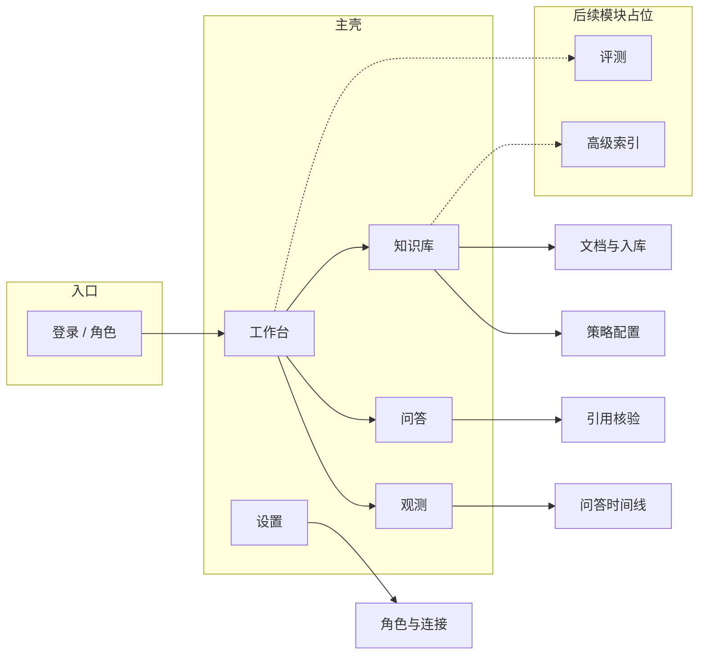
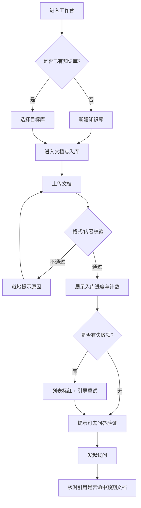
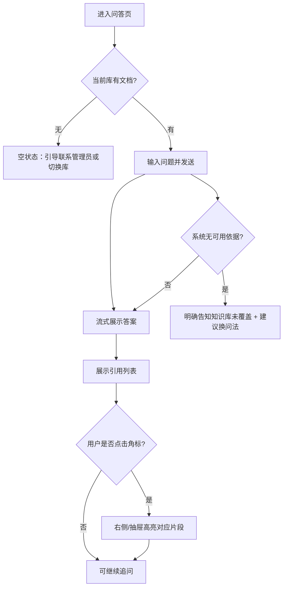
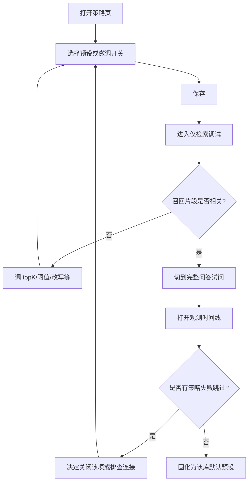
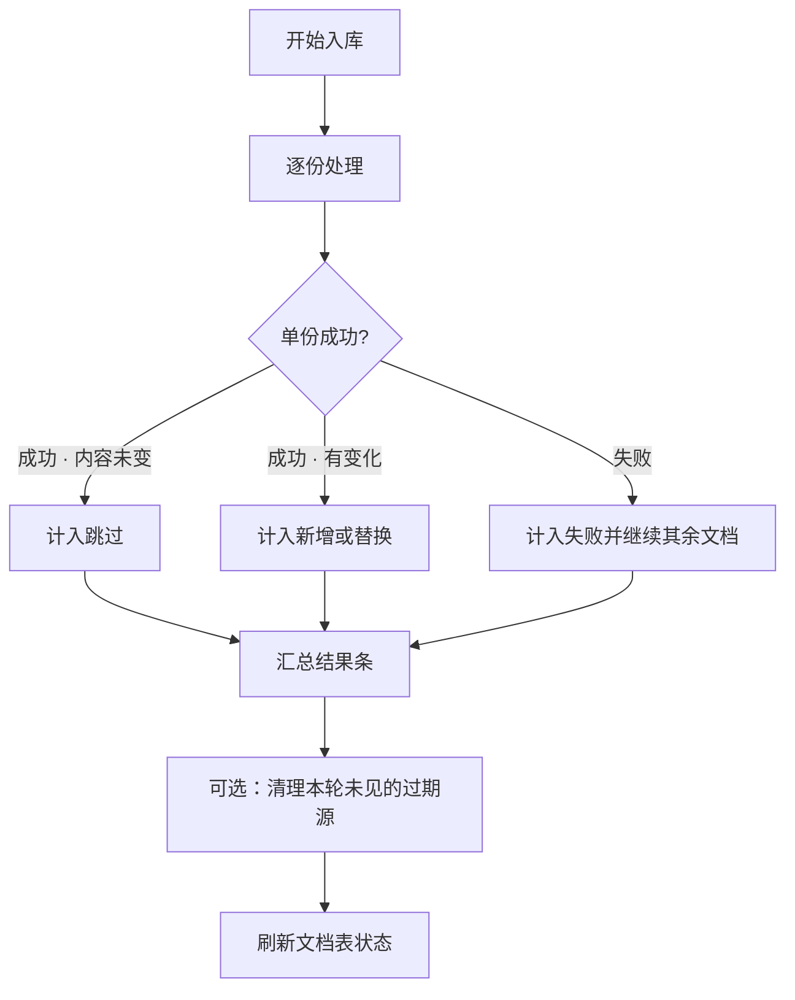

# MonAI RAG 知识库问答控制台 — 原型设计稿

> 面向「知识库管理员维护 + 业务终端用户问答」的完整业务产品形态。  
> 本稿描述体验与信息结构，不绑定具体前端框架；实现上可逐步对接 monai-ragsdk 已落地能力，并为路线图中尚未完成的模块预留扩展位。  
> **范围说明**：忽略 CLI；不以 SDK Demo 为最终产品形态。

---

## 1. 需求概述

### 1.1 目标用户

| 角色             | 画像                                       | 使用频率                         | 核心诉求                                                       |
| ---------------- | ------------------------------------------ | -------------------------------- | -------------------------------------------------------------- |
| **知识库管理员** | 负责内容准入、集合维护、问答效果与策略调优 | 中高频（建设期每天，稳定期按需） | 可靠入库、可感知索引状态、能解释「为什么答成这样」、少踩配置坑 |
| **业务终端用户** | 只关心提问与可信答案                       | 高频（工作中随时问）             | 问得快、答得准、能点开出处；不暴露管道细节                     |

同一产品内用**角色视图**区分信息密度：终端用户默认进入「问答」；管理员可进入「知识库 / 策略 / 观测」。

### 1.2 核心场景

1. **建库与入库**：管理员创建知识库（Collection），上传或同步文档，看到增量更新 / 跳过 / 失败隔离结果。
2. **工作问答**：终端用户在选定知识库内提问，流式阅读答案，并依据引用片段核验。
3. **效果调优**：管理员对比「仅检索」与「完整问答」，开关检索前 / 检索后策略，查看一次问答的阶段轨迹。
4. **持续运维（后续）**：排查失败文档、清理过期源、评测回归、权限与多租户。

### 1.3 要解决的痛点 / 设计目标

| 痛点                       | 设计目标（成功长什么样）                                               |
| -------------------------- | ---------------------------------------------------------------------- |
| 知识散落、口头答不可信     | 答案默认带可点击的引用溯源，用户能「对上原文」                         |
| 入库黑盒：不知是否更新成功 | 入库结果用「新增 / 跳过 / 替换 / 失败 / 清理」计数说人话               |
| 策略多但难用               | 策略按阶段分组、默认推荐组合；高级项折叠，失败不拖死主问答             |
| 出问题难排查               | 每次问答可展开「阶段时间线」，管理员可看有效查询、召回与筛选变化       |
| 产品会随 SDK 演进          | 信息架构预留「评测 / 高级切分 / Active RAG」等模块入口，MVP 不强迫上线 |

### 1.4 范围与边界

**本期（MVP）做：**

- 知识库列表与进入；文档源列表（基于 `listSources` 能力语义）
- 文档入库（ingest）与结果反馈；基础删除 / 按条件清理（能力具备时启用）
- 问答（ask，支持流式）；仅检索（search）供管理员调试
- 引用 / grounding 展示
- 策略配置的「推荐开关面」（检索前：改写 / 多路等；检索后：重排 / 压缩等）——以产品开关表达，不暴露 SDK 类名
- 观测摘要：单次问答时间线 / 事件列表（轻量）

**本期明确不做（或只留入口占位）：**

- CLI 相关体验
- 完整文档生命周期（版本树、协作编辑、审批流）
- Active RAG / 自纠错循环
- 答案内特殊标记解析
- 第二套查询 / 存储路径（如 Chroma 查询）作为产品选项
- 正式评测中心（eval 未落地前仅占位）
- 对接外部 APM（如 OTLP）的完整运维台
- 复杂权限体系（MVP 用简单「管理员 / 普通用户」即可）

### 1.5 关键约束（产品侧表述）

- 每个知识库对应一套「入库 + 检索 + 问答」闭环；产品不暗示存在多套互斥的向量库查询路径。
- 策略失败默认「降级继续答」，避免用户看到整页失败；管理员可在时间线里看到策略跳过原因。
- 流式优先：长答案边出边看；引用在答案稳定后汇总展示（或随片段逐步出现，见交互说明）。
- 设计可扩展：页面与导航为后续「评测、高级切分、混合检索、多模态解析」留位，但 MVP 不堆功能。

---

## 2. 信息架构 & 页面布局

### 2.0 全局信息架构



**导航原则：**

- 终端用户默认着陆：**问答**（需先选知识库，或记住上次）。
- 管理员默认着陆：**工作台**（待办：失败入库、空库引导、近期问答质量信号）。
- 「评测 / 高级索引」在导航中以灰色或「即将推出」展示，避免用户以为已可用。

---

### 2.1 工作台（Home）

**布局策略**：上区「当前知识库快捷入口 + 提问框」，下区「健康卡片 + 最近动态」。终端用户可把下区健康卡片收起，只留提问。

```
┌──────────────────────────────────────────────────────────────────────────┐
│  MonAI RAG          [知识库 ▾ 产品手册库]     🔔   头像 ▾（管理员）        │
├────────┬─────────────────────────────────────────────────────────────────┤
│        │  工作台                                                          │
│ 工作台  │  ┌────────────────────────────────────────────────────────────┐ │
│ 知识库  │  │  有问题？直接问当前知识库                                   │ │
│ 问答    │  │  [________________________________________]  [ 提问 → ]   │ │
│ 观测    │  └────────────────────────────────────────────────────────────┘ │
│ 设置    │                                                                  │
│        │  ┌─────────────┐ ┌─────────────┐ ┌─────────────┐                │
│ ·评测   │  │ 文档源 128  │ │ 近7日问答   │ │ 失败入库 2  │                │
│ (占位)  │  │ 上次入库 ✓  │ │ 312 次      │ │ [去处理]    │                │
│        │  └─────────────┘ └─────────────┘ └─────────────┘                │
│        │                                                                  │
│        │  最近动态                                                         │
│        │  · 10:21 入库完成：新增 3 / 跳过 40 / 失败 0                      │
│        │  · 10:05 用户提问「退货时效？」→ 已引用 4 段                      │
│        │  · 昨日 策略：开启「查询改写」                                    │
└────────┴─────────────────────────────────────────────────────────────────┘
```

**分区说明：**

- **顶栏知识库切换**：全局上下文；切换后问答 / 文档 / 策略都切到该库。
- **快捷提问**：降低「还要再点问答页」的摩擦。
- **健康卡片**：把索引与质量问题推到管理员眼前，而不是埋在日志里。
- **评测占位**：侧栏可见但不可进，或点开说明「能力建设中」。

---

### 2.2 知识库列表

**布局策略**：卡片网格为主，强调「库名 / 文档量 / 健康状态 / 进入」。创建是唯一强操作。

```
┌──────────────────────────────────────────────────────────────────────────┐
│  知识库                                              [搜索]  [ + 新建库 ] │
├──────────────────────────────────────────────────────────────────────────┤
│  ┌────────────────────┐  ┌────────────────────┐  ┌────────────────────┐ │
│  │ 产品手册库          │  │ 内部制度库          │  │  + 新建知识库       │ │
│  │ 文档 128 · 健康     │  │ 文档 56 · 有告警    │  │  上传文档开始…      │ │
│  │ 默认策略：均衡      │  │ 失败入库 2          │  │                     │ │
│  │ [进入] [问答]       │  │ [进入] [问答]       │  │                     │ │
│  └────────────────────┘  └────────────────────┘  └────────────────────┘ │
└──────────────────────────────────────────────────────────────────────────┘
```

**新建知识库（弹层）：**

```
┌────────────── 新建知识库 ─────────────────┐
│  名称     [________________]              │
│  说明     [________________]              │
│  入库模式 (•) 增量更新  ( ) 全量重建      │
│  说明：增量会跳过未变化文档，减少重复计算  │
│                                           │
│              [ 取消 ]  [ 创建并去入库 ]    │
└───────────────────────────────────────────┘
```

---

### 2.3 知识库详情 · 文档与入库

**布局策略**：左摘要 + 右文档表；顶部「入库」为第一操作。状态列用人话表达增量语义（新增 / 未变跳过 / 已替换 / 失败）。

```
┌──────────────────────────────────────────────────────────────────────────┐
│  产品手册库 / 文档与入库          [ 策略 ] [ 仅检索调试 ] [ 去问答 ]      │
├──────────────────────────────────────────────────────────────────────────┤
│  ┌──────────────┐  上次入库：今天 10:21 · 增量                          │
│  │ [ 上传入库 ]  │  新增 3 · 跳过 40 · 替换 1 · 失败 0 · 清理过期 0     │
│  │ [ 从目录同步] │                                                      │
│  │ (后续)        │  [搜索源 ID / 标题]     状态 ▾    [ 清理无效源 ]      │
│  └──────────────┘                                                      │
│  ┌──────┬────────────┬──────────┬──────────┬──────────────────────────┐ │
│  │ 源ID │ 标题/路径   │ 状态     │ 更新时间  │ 操作                     │ │
│  ├──────┼────────────┼──────────┼──────────┼──────────────────────────┤ │
│  │ d-12 │ 退货政策.md │ 已索引   │ 10:21    │ 重新入库 · 查看块 · 删除 │ │
│  │ d-09 │ FAQ.md     │ 失败     │ 10:20    │ 重试 · 查看原因           │ │
│  │ d-01 │ 手册.pdf   │ 未变化   │ 昨天     │ …                        │ │
│  └──────┴────────────┴──────────┴──────────┴──────────────────────────┘ │
│                                              [ 分页  1  2  3  > ]       │
└──────────────────────────────────────────────────────────────────────────┘
```

**上传入库进度（抽屉或进度条）：**

```
┌──────────── 入库进行中 ───────────────────┐
│  正在处理 12 / 48                         │
│  ████████░░░░░░░░  当前：退货政策.md       │
│                                           │
│  实时：新增 2 · 跳过 9 · 失败 1            │
│  · FAQ.md 失败：内容为空，已跳过并继续     │
│                                           │
│                         [ 后台继续 ]      │
└───────────────────────────────────────────┘
```

**分区说明：**

- 计数条直接映射「增量索引」心智：用户不必理解 fingerprint，但要理解「没变会跳过」。
- 「查看块」为后续能力：MVP 可只做「源列表 + 状态」；块级浏览放 V2。
- 「从目录同步」标为后续，避免 MVP 绑定本地路径运维复杂度。

---

### 2.4 问答页（终端用户主场景）

**布局策略**：左对话流 + 右引用面板（宽屏）；窄屏改为答案下方折叠「依据」。输入区固定底部；支持流式输出。

```
┌──────────────────────────────────────────────────────────────────────────┐
│  问答 · 产品手册库                    模式：(•) 问答  ( ) 仅检索(管理)   │
├────────────────────────────────────┬─────────────────────────────────────┤
│  对话                               │  本轮依据                          │
│                                     │  ┌───────────────────────────────┐ │
│  你：退货时效是多久？                │  │ [1] 退货政策.md · 相似度高     │ │
│                                     │  │  …自签收之日起 7 日内…         │ │
│  助手：一般情况下，自签收之日起      │  │ [查看原文片段]                │ │
│  7 日内可申请退货[1]。若商品…[2]    │  ├───────────────────────────────┤ │
│  ▍（流式输出中）                     │  │ [2] FAQ.md                    │ │
│                                     │  │  …特殊品类除外…               │ │
│                                     │  └───────────────────────────────┘ │
│                                     │  有效提问（改写后，可折叠）         │
│                                     │  「商品退货申请时限」               │
├────────────────────────────────────┴─────────────────────────────────────┤
│  [+ 附件(后续)]  [________________ 输入问题 ________]  [ 发送 ]          │
│  提示：答案均基于当前知识库；可点击角标查看原文。                          │
└──────────────────────────────────────────────────────────────────────────┘
```

**空状态（无文档）：**

```
┌────────────────────────────────────────────┐
│         这个知识库还没有文档                │
│   请先让管理员完成入库，或切换其他知识库    │
│              [ 去文档与入库 ]               │
└────────────────────────────────────────────┘
```

**分区说明：**

- **引用角标 [n]** 与右侧列表一一对应，建立信任闭环。
- **「有效提问」** 对管理员默认展开、对终端用户默认折叠——避免普通用户被「改写」干扰。
- **仅检索模式** 只对管理员显示：展示排序后的片段列表，不生成答案，用于调 topK / 阈值。

---

### 2.5 仅检索调试（管理员）

```
┌──────────────────────────────────────────────────────────────────────────┐
│  仅检索调试 · 产品手册库                              [ 切回完整问答 ]   │
├──────────────────────────────────────────────────────────────────────────┤
│  查询 [________________________________]  topK [10 ▾]  [ 检索 ]         │
│  过滤：来源 ▾   元数据标签 ▾（后续）                                      │
│                                                                          │
│  结果 8 条（已应用：分数阈值 / 去重 / 预算裁剪）                           │
│  ┌────┬──────────┬───────┬────────────────────────────────────────────┐ │
│  │ #  │ 来源      │ 分数  │ 片段摘要                                    │ │
│  ├────┼──────────┼───────┼────────────────────────────────────────────┤ │
│  │ 1  │ 退货政策  │ 0.86  │ 自签收之日起 7 日内…                        │ │
│  │ 2  │ FAQ      │ 0.81  │ 特殊品类除外…                               │ │
│  └────┴──────────┴───────┴────────────────────────────────────────────┘ │
│  [ 用该查询发起完整问答 → ]                                               │
└──────────────────────────────────────────────────────────────────────────┘
```

---

### 2.6 策略配置

**布局策略**：按「检索前 → 检索 → 检索后 → 生成」四段时间线排布开关；每段给「推荐预设」一键套用。高级参数折叠。文案用业务语言，不出现实现类名。

```
┌──────────────────────────────────────────────────────────────────────────┐
│  策略 · 产品手册库                         预设：[ 均衡 ▾ ] [ 另存为 ]   │
├──────────────────────────────────────────────────────────────────────────┤
│  预设说明：均衡 = 改写开 + 多路查询关 + 轻量重排 + 压缩开（适合日常）    │
│                                                                          │
│  ┌─ 1. 提问预处理 ─────────────────────────────────────────────────────┐ │
│  │  [✓] 查询改写     把口语问法改成更利于检索的表述                     │ │
│  │  [ ] 查询扩展     补充相关说法（可能增加召回与耗时）                 │ │
│  │  [ ] 问题拆解     复杂问题拆成多个子问题                             │ │
│  │  [ ] 多路查询     同一意图多种措辞并行检索后融合                     │ │
│  │  [ ] 查询路由     按问题类型调整召回量/过滤（高级）                  │ │
│  └─────────────────────────────────────────────────────────────────────┘ │
│  ┌─ 2. 检索 ───────────────────────────────────────────────────────────┐ │
│  │  召回数量 topK [ 8 ]     （混合检索 / 稀疏检索：后续）               │ │
│  │  元数据过滤：预留                                                     │ │
│  └─────────────────────────────────────────────────────────────────────┘ │
│  ┌─ 3. 检索后处理 ─────────────────────────────────────────────────────┐ │
│  │  [✓] 分数阈值过滤   低于 [0.20] 丢弃                                 │ │
│  │  [✓] 近重复去除                                                       │ │
│  │  [✓] 上下文预算     最多保留 [5] 段                                  │ │
│  │  [ ] 来源覆盖增强   尽量覆盖更多不同文档                             │ │
│  │  [✓] 智能重排序     用模型对候选再排序（更准，更慢更贵）             │ │
│  │  [✓] 上下文压缩     压缩后再生成，减少噪音                           │ │
│  │  [ ] 首尾重排       重要段落放开头与结尾（缓解「中间遗忘」）         │ │
│  └─────────────────────────────────────────────────────────────────────┘ │
│  ┌─ 4. 生成 ───────────────────────────────────────────────────────────┐ │
│  │  [✓] 引用溯源       答案附带出处编号（推荐常开）                     │ │
│  │  [ ] Active RAG     答不稳时自动再检索（后续 · 暂不可用）            │ │
│  │  兜底：无依据时 → (•) 明确说「知识库未覆盖」  ( ) 仍尝试泛化回答     │ │
│  └─────────────────────────────────────────────────────────────────────┘ │
│                                                      [ 恢复默认 ] [ 保存 ]│
└──────────────────────────────────────────────────────────────────────────┘
```

**设计取舍：**

- 「推荐预设」降低管理员认知负担；专家再展开单项。
- Active RAG 可见但禁用，避免产品承诺与能力脱节。
- 混合检索、语义切分等放在「高级索引」后续模块，不挤进本页。

---

### 2.7 观测 · 问答时间线

**布局策略**：左列表（近期问答 / 入库任务）+ 右时间线细节。默认只给管理员。

```
┌──────────────────────────────────────────────────────────────────────────┐
│  观测                                                                     │
│  Tab: [ 问答轨迹 ] [ 入库任务 ] [ 导出(后续) ]                            │
├────────────────────┬─────────────────────────────────────────────────────┤
│  筛选：近24小时     │  Trace #a3f2 · 10:05 · 耗时 2.4s · 成功            │
│  [搜索问题关键词]   │                                                     │
│                    │  原问题：退货时效是多久？                            │
│  · 10:05 退货时效… │  有效问题：商品退货申请时限                          │
│  · 10:01 发票怎么… │                                                     │
│  · 09:40 运费谁…   │  ● 接收提问                                         │
│                    │  ● 预处理 · 改写完成 (+120ms)                        │
│                    │  ● 检索 · 召回 20 → 融合后 12                        │
│                    │  ● 后处理 · 阈值过滤掉 4 · 重排 · 压缩 → 剩 5        │
│                    │  ● 生成 · 流式完成 · 引用 4                          │
│                    │                                                     │
│                    │  警告：扩展策略失败已跳过（未影响回答）              │
│                    │  [ 查看引用片段 ]  [ 用相同策略重放(后续) ]          │
└────────────────────┴─────────────────────────────────────────────────────┘
```

---

### 2.8 设置（轻量）

```
┌──────────────────────────────────────────────────────────────────────────┐
│  设置                                                                     │
│  · 外观：紧凑 / 舒适                                                      │
│  · 默认着陆页：工作台 / 问答                                              │
│  · 角色（演示）：管理员 ↔ 终端用户（便于评审切换）                        │
│  · 连接与模型：由部署环境注入，页面只展示「已连接 / 未配置」状态          │
│    （不在界面收集密钥明文）                                               │
└──────────────────────────────────────────────────────────────────────────┘
```

---

### 2.9 后续模块占位（可扩展骨架）

以下不画完整交互，只在信息架构中占位，保证「以后加模块不推翻导航」。

| 模块                | 用户价值                                   | 预留入口                   |
| ------------------- | ------------------------------------------ | -------------------------- |
| **评测中心**        | 用黄金集回归「改策略有没有变差」           | 侧栏「评测」               |
| **高级索引**        | 语义切分、结构感知切分、父子块、多模态解析 | 知识库 →「索引方案」Tab    |
| **混合检索**        | 关键词 + 向量互补                          | 策略页「检索」段扩展       |
| **Active RAG**      | 低置信时自动再检索                         | 策略页生成段（已占位禁用） |
| **权限与空间**      | 多团队隔离                                 | 顶栏空间切换               |
| **块级浏览 / 版本** | 精细排错与内容审计                         | 文档表「查看块」           |

---

## 3. 用户操作路径（User Flow）

### 3.1 管理员：从空库到可问答



### 3.2 终端用户：提问与核验出处



### 3.3 管理员：策略调优闭环



### 3.4 入库异常分支（体验易崩点）



---

## 4. 关键交互说明

| 场景             | 行为                                                                                   |
| ---------------- | -------------------------------------------------------------------------------------- |
| 全局知识库上下文 | 顶栏切换库时，未发送的输入框内容提示「将清空或保留？」；默认保留草稿但标注所属库变更。 |
| 流式问答         | 生成中发送按钮变为「停止」；停止后保留已生成部分，并标注「已中断」。                   |
| 引用展示         | 角标与右侧列表同步高亮；无引用时不显示空面板，改为「本轮未产生引用」。                 |
| 策略失败         | 用户侧答案仍尽量给出；观测时间线出现黄色「已跳过」事件；不弹阻断式错误。               |
| 入库失败隔离     | 单文档失败不中断整批；结果条与表格行同时可见失败原因摘要。                             |
| 危险操作         | 删除源、清理过期源、全量重建：二次确认，确认文案写清不可恢复范围。                     |
| 搜索 / 筛选      | 文档表：输入防抖即时过滤；仅检索页：点「检索」按钮执行，避免昂贵误触。                 |
| 角色演示切换     | 设置中可一键切「管理员 / 终端用户」视图，便于评审；真实部署接权限后移除此开关。        |
| 空状态           | 每页空状态都给**一个**主行动点（去入库 / 去新建 / 去提问），避免多个同等按钮。         |
| 占位模块         | 点击「评测 / Active RAG / 高级索引」→ 说明卡片：「规划中，不影响当前问答」。           |

---

## 5. Feature Backlog（功能优先级）

| 功能                                       | 版本 | 优先级 | 价值 / 理由                                        |
| ------------------------------------------ | ---- | ------ | -------------------------------------------------- |
| 知识库列表 / 新建 / 切换                   | MVP  | P0     | 产品上下文根；没有库则一切无从谈起                 |
| 文档入库 + 结果计数（新增/跳过/替换/失败） | MVP  | P0     | 对应增量索引心智；建立内容可信基础                 |
| 文档源列表与失败重试                       | MVP  | P0     | 管理员闭环；失败不可见则不可运维                   |
| 问答（流式）+ 引用面板                     | MVP  | P0     | 终端用户主价值；信任来自出处                       |
| 无依据时的明确兜底文案                     | MVP  | P0     | 减少幻觉体感，降低业务风险                         |
| 策略推荐预设 + 核心开关                    | MVP  | P0     | 让已具备的改写/重排/压缩等能力可被「用起来」       |
| 仅检索调试页                               | MVP  | P1     | 调优刚需，但可次于「先能问」                       |
| 观测：单次问答时间线                       | MVP  | P1     | 解释「改写后问了什么、过滤掉了什么」               |
| 按条件删除 / 过期源清理                    | MVP  | P1     | 有能力则上；避免脏数据积累                         |
| 工作台健康卡片与动态                       | MVP  | P1     | 提升管理员效率，非最小闭环必需                     |
| 块级内容浏览                               | V2   | P1     | 排错与审计；依赖更完整文档模型                     |
| 目录同步入库                               | V2   | P1     | 降低大批量上传摩擦                                 |
| 元数据过滤 UI                              | V2   | P1     | 检索精度；依赖元数据体系建设                       |
| 策略预设另存 / 多预设对比                  | V2   | P2     | 多场景库需要；早期一个默认即可                     |
| 轨迹导出 / 重放                            | V2   | P2     | 协作排障；MVP 看页面即可                           |
| 评测中心（黄金集 / 回归）                  | V2+  | P1     | 策略调优从「感觉」到「度量」；待 eval 能力授权后做 |
| 高级切分 / 多模态解析配置                  | V2+  | P1     | 对应复杂文档场景；索引方案独立模块                 |
| 混合检索 / 稀疏检索                        | V2+  | P2     | 补向量检索短板；产品上挂在检索段扩展               |
| Active RAG                                 | 后续 | P2     | 路线图仍冻结；只保留禁用入口                       |
| 多租户权限 / 空间                          | 后续 | P2     | 组织规模上来再做                                   |
| 外部 APM 对接视图                          | 后续 | P2     | 观测协议稳定后再接，避免过早绑定                   |

---

## 6. 设计假设（请复核）

1. **产品名**暂用「MonAI RAG 知识库问答控制台」；可随品牌替换，不影响信息架构。
2. **MVP 角色**用「管理员 / 终端用户」二分足够；不做细粒度 RBAC。
3. **一个知识库 = 一套策略与一套文档集合**；暂不支持库内多 Pipeline 并行供用户勾选。
4. **密钥与模型连接**由部署注入，界面只读状态——符合「页面不收集明文密钥」的安全取向。
5. **忽略 CLI**；本设计假设存在（或将有）Web 控制台作为主交互面。
6. **可扩展优先于一次做满**：侧栏与策略页为评测、高级索引、Active RAG 留位，但 MVP 验收不依赖它们。

---

## 7. 交稿说明

本稿覆盖页面：**工作台、知识库列表、文档与入库、问答、仅检索调试、策略配置、观测时间线、设置**，并为**评测 / 高级索引 / Active RAG** 等预留扩展位。

**关键取舍：**

- MVP 砍掉完整文档生命周期、块级浏览、评测中心、Active RAG，是为了先打通「入库 → 可引用问答 → 可解释调优」。
- 策略用「预设 + 阶段开关」而不是专家表单，是为了降低管理员门槛，同时仍映射现有 pipeline 阶段能力。
- 观测做成「问答时间线」而不是通用 APM，是为了直接服务「为什么这次答成这样」。

若需下一稿细化，建议优先指定：**视觉风格参考**、**是否只要管理员单角色简化版**、或**先做高保真可点击 HTML 原型**（可另开 prototype-to-html 流程）。
`)
