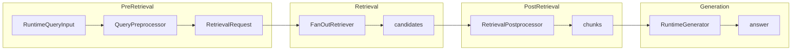
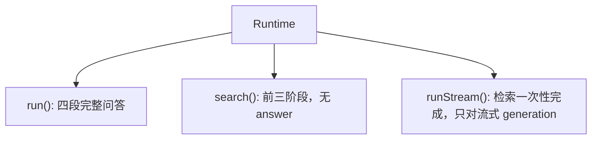
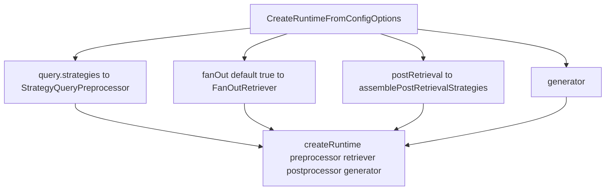

# `@monai-ragsdk/runtime`

## 定位

在线 RAG 内核。把 **pre-retrieval → retrieval → post-retrieval → generation** 串成可组合 pipeline，并提供知识库门面 MVP `createCollection()`。

策略件本体在本包；厂商 LLM / 向量库实现在 [`@monai-ragsdk/adapters`](../adapters/README.md)。离线 ingest 在 [`@monai-ragsdk/indexing`](../indexing/README.md)。

现状、边界与缺口见 [`docs/packages/runtime.md`](../../docs/packages/runtime.md)。

## 依赖

- workspace：`core`、`observability`、`indexing`
- 被谁用：`adapters`（实现 `RuntimeRetriever` / `RuntimeGenerator` / `RuntimeStrategyModel`）、`apps/example`、`apps/server`

依赖 `indexing` 的原因：`createCollection().ingest()` 调用 `runIndexing`；另外提供 indexing 查询协议（按 sourceId / fingerprint / hierarchy 过滤候选）。不是误引。

实现 `RuntimeRetriever` 时请从 `@monai-ragsdk/runtime/contract` 引用 `createIndexingRetrievalCandidate`、`filterRetrievalCandidatesByIndexingFilters`、`fuseByReciprocalRankFusion`、`enforceRetrievalRequestFilters`。这些符号已从包根撤出，避免内部 `apply*` / 解析函数被锁成公开 API。

## Pipeline 总览

四段顺序固定。中间对象是 `RetrievalRequest`（查询意图）和 `RetrievalCandidate[]`（召回候选）；生成阶段只消费 post-retrieval 选出的 chunks。



`RetrievalRequest` 携带 `effectiveQuery`、`subQueries`、`routeDecision`、`filters`、`budget`。retrieve 之后编排层会调用 `enforceRetrievalRequestFilters`；citations 按 post-retrieval 选出的 chunks 顺序编号。

| 阶段           | 输入                | 输出                    |
| -------------- | ------------------- | ----------------------- |
| Pre-retrieval  | `RuntimeQueryInput` | `RetrievalRequest`      |
| Retrieval      | `RetrievalRequest`  | `candidates`            |
| Post-retrieval | `candidates`        | `chunks`（+ citations） |
| Generation     | `chunks` + request  | `answer`                |

三种运行入口共用前三阶段；差别只在是否调用 generator：



`runStream()` 无 `generateStream` 时回退为单段完整答案。`runtime.close()` 调用 `retriever.close?.()`。`createDefaultRuntime()` 缺省 preprocessor 为 `NoopQueryPreprocessor`，postprocessor 为 `PassthroughRetrievalPostprocessor`。

## 1. Pre-retrieval（检索前处理）

职责：把用户 query 变成下游可消费的 `RetrievalRequest`。`originalQuery` 不变；改写写在 `effectiveQuery`。

编排：`StrategyQueryPreprocessor` 按数组顺序执行 `QueryStrategy[]`。不配策略时走 `NoopQueryPreprocessor`。

| 工厂                                                          | 行为                                                                                   | 下游怎么用                                         |
| ------------------------------------------------------------- | -------------------------------------------------------------------------------------- | -------------------------------------------------- |
| `createQueryRewriteStrategy`                                  | 改写 `effectiveQuery`                                                                  | 检索读 effectiveQuery                              |
| `createQueryExpansionStrategy`                                | 相关查询写入 `subQueries`                                                              | FanOut 多路                                        |
| `createQueryDecompositionStrategy`                            | 拆成可独立检索的子问题                                                                 | FanOut 多路                                        |
| `createMultiQueryStrategy`                                    | 同一意图多种措辞                                                                       | FanOut 多路                                        |
| `createLlmRoutingStrategy` / `createRuleBasedRoutingStrategy` | 写入 `routeDecision`（targets / skip / searchType），以及可选 route / budget / filters | FanOut 消费 targets/skip；pgvector 消费 searchType |

`createQueryRoutingStrategy` 仍可用（内部创建 `LlmRoutingResolver`），新代码请用上面两个工厂。

LLM 策略默认失败透传，避免检索被策略拖死；需要硬失败时设 `onError: 'throw'`。空 `effectiveQuery` 不调模型。routing 没有可用 route **且没有** `routeDecision` 时整单透传。

```ts
query: {
  strategies: [
    createQueryRewriteStrategy({ model }),
    createLlmRoutingStrategy({ model, availableTargets: ['pgvector'] }),
  ],
}
```

## 2. Retrieval（检索）

职责：按 `RetrievalRequest` 召回 `candidates`。本包提供编排（`FanOutRetriever`），不实现向量库；默认查询路径是 adapters 的 `PgVectorRuntimeRetrieverAdapter`。

`createRuntimeFromConfig` 默认包一层 FanOut（`fanOut: false` 可关掉；已是 `FanOutRetriever` 时不再套一层）：

- 读 `subQueries` 与 `routeDecision`
- 无 `subQueries` 且无 `targets` 时只调 `#retrievers[0]`
- `retrievalMode: skip`、`targets: []`、或不匹配的 targets：**不调子 retriever**，`candidates: []`，`retrievalMetadata.skipped: true`，禁止回退 `[0]`
- 多路召回默认 `fuseByReciprocalRankFusion`（RRF，k=60）；FanOut 不因 `searchType` 改融合算法

编排层在 retrieve **之后**强制 `enforceRetrievalRequestFilters`。adapter 的 `filterByRequest: false` 只表示自己不预过滤，runtime 仍会丢弃不匹配候选。

`RuntimeRetriever` 可选 `id` / `name` / `capabilities.searchTypes` / `close()`。自定义 retriever 若不设 `id`，`routeDecision.targets` 匹配不到就会 skip。

条数语义：`budget.maxChunks` 为权威；`topK` 为单向别名（写入 budget，不反向覆盖）。

```ts
retriever: {
  async retrieve(request) {
    return {
      candidates: [
        {
          chunk: { id: 'c1', content: request.effectiveQuery.query },
          score: 0.9,
          scoreKind: 'retriever',
        },
      ],
    };
  },
}
```

## 3. Post-retrieval（检索后处理）

职责：过滤、裁剪、重排候选，得到生成用的 chunks。可交给 `createRuntimeFromConfig` 的 `postRetrieval`，或用 `StrategyRetrievalPostprocessor` / `createDefaultPostprocessor` 自定义链。

`createRuntimeFromConfig` 的官方顺序：

`llm-rerank → score-threshold → predicate → dedupe → budget-trim → source-coverage → ordering → compression → lost-in-the-middle`

`rerank` / `compression` / `lostInTheMiddle` 只有显式配置才插入。历史 `PassthroughRetrievalPostprocessor` 未改顺序（仍以 threshold 开头、不含 rerank）。传入 `postRetrieval.strategies` 则完全覆盖官方顺序。

| 工厂 / 配置                                          | 行为                            |
| ---------------------------------------------------- | ------------------------------- |
| `scoreThreshold` / `createScoreThresholdStrategy`    | 按分数过滤                      |
| `predicate` / `createPredicateFilterStrategy`        | 自定义谓词                      |
| `createNearDuplicateRemovalStrategy`                 | 近重复去除                      |
| `budget` / `createBudgetTrimStrategy`                | 条数裁剪                        |
| `createSourceCoverageStrategy`                       | 来源覆盖                        |
| `createCandidateOrderingStrategy`                    | 排序                            |
| `rerank: createLlmRerankStrategy(...)`               | 真实 LLM 重排序，写回分标 `llm` |
| `compression: createContextCompressionStrategy(...)` | 上下文压缩                      |
| `lostInTheMiddle: true`                              | 高分居首尾，只重排不丢弃        |

`RetrievalCandidate.scoreKind` 为 `retriever` | `rrf` | `llm`。阈值在无 kind、混口径、或 `expectedScoreKind` 不符时**拒绝比较、整批透传**，不会静默全丢。口径细节见 [runtime Wiki 第 4.3 节](../../docs/packages/runtime.md)。

LLM 策略同样默认失败透传。`llm-rerank` 零候选不调模型。

```ts
postRetrieval: {
  scoreThreshold: 0.2,
  budget: { maxChunks: 5 },
  rerank: createLlmRerankStrategy({ model }),
  lostInTheMiddle: true,
}
```

## 4. Generation（生成）

职责：根据 chunks 生成答案。**没有完整 GenerationStrategy 链。** 接口是 `generate` / 可选 `generateStream`。厂商实现放 adapters（如 `OpenAIRuntimeGenerator`）。

`RuntimeGeneratorInput.grounding` 仅在 `chunks.length === 0` 时出现。产品拒答 / 泛化用官方包装器：

```ts
import { createGroundingPolicyRuntimeGenerator } from '@monai-ragsdk/runtime';

const generator = createGroundingPolicyRuntimeGenerator(vendorGenerator, {
  policy: 'explicit', // 或 'generalize'
});
```

| `chunksEmptyReason` | `explicit` | `generalize` |
| ------------------- | ---------- | ------------ |
| `no-hits` / `filtered` | 模板拒答，不调 inner | 注入 prompt 后调 LLM |
| `skipped` | 调 LLM（豁免 explicit） | 调 LLM |
| 有 chunks | 正常 grounded | 正常 grounded |

厂商 generator 可继续忽略 `grounding`；装配时包一层即可。

`run()` 允许空字符串答案；`runStream()` 对空答案抛错。这是刻意历史分叉，尚未统一。

结果带 grounding citations：`run` / `runStream` / `search` 共用同一套规则。

## 装配 Runtime

推荐 `createRuntimeFromConfig()`：从 query / postRetrieval / retriever / generator 编译 Runtime。



原子拼装用 `createRuntime()` / `createDefaultRuntime()`：自己传入 preprocessor / retriever / postprocessor / generator，不会自动套 FanOut 或官方 post 顺序。

### Quick Start

```ts
import {
  createQueryRewriteStrategy,
  createRuntimeFromConfig,
  type RuntimeRetriever,
} from '@monai-ragsdk/runtime';
import { OpenAIRuntimeGenerator, OpenAIStrategyModel } from '@monai-ragsdk/adapters';

const model = new OpenAIStrategyModel({
  model: 'deepseek-chat',
  baseUrl: process.env.OPENAI_BASE_URL!,
});

// retriever 由 adapters 提供，默认用 PgVectorRuntimeRetrieverAdapter
declare const retriever: RuntimeRetriever;

const runtime = createRuntimeFromConfig({
  retriever,
  query: {
    strategies: [createQueryRewriteStrategy({ model })],
  },
  postRetrieval: {
    scoreThreshold: 0.2,
    budget: { maxChunks: 5 },
  },
  generator: new OpenAIRuntimeGenerator({
    model: 'deepseek-chat',
    baseUrl: process.env.OPENAI_BASE_URL!,
  }),
});

const result = await runtime.run(
  { query: '什么是 runtime？' },
  // 可选；不传时 requestId / traceId 由内核生成 UUID
  { requestId: 'req-1', trace: { traceId: 'trace-1' } },
);
```

无真实 LLM 的策略链演示见 [`demo/strategy-pipeline.ts`](./demo/strategy-pipeline.ts)。

## Collection 门面 MVP

`createCollection({ indexing, runtime })` 只做编排，不另开存储 / 查询路径：

| 方法                                              | 行为                                                 |
| ------------------------------------------------- | ---------------------------------------------------- |
| `ingest(documents)`                               | 临时 in-memory Loader → `runIndexing`                |
| `search(query)`                                   | retrieve-only（前三阶段）                            |
| `ask(query)`                                      | 完整 `runtime.run()`                                 |
| `listSources()` / `deleteByFilters()` / `close()` | store 未实现对应方法时返回空 / `false`，不当错误抛出 |

不要新开 kb 包，也不要在这里扩展完整文档生命周期。演示：[`demo/collection-demo.ts`](./demo/collection-demo.ts)。

## 可观测

把 `observer` 交给 `createRuntime` / `createDefaultRuntime` / `createRuntimeFromConfig` 后，主流程打阶段检查点；下列编排器额外打策略步进，写入同一条 trace。字段约定见 [`@monai-ragsdk/observability` README](../observability/README.md)。

- `StrategyQueryPreprocessor`：`runtime.query_strategy.complete`（未改检索意图时 `outcome: passthrough`）
- `FanOutRetriever`：真正多路时 `runtime.retrieval_fanout.*` 与 `runtime.retrieval_fuse.complete`
- `StrategyRetrievalPostprocessor`（含默认 `PassthroughRetrievalPostprocessor`）：`runtime.post_retrieval_strategy.complete`

自定义实现可走 `context.observe?.emit(...)`；`adapters` 忽略即可。观测失败不会打断检索。

`RetrievalRequest.appliedStrategies` 与 `PostRetrievalResult.appliedStrategies` 只记真正改变了意图/候选的策略名；透传只出现在 observer 的 `outcome: passthrough`。

`run()` / `runStream()` / `search()` 共用同一套关联键解析。ID 是不透明关联键，query 只出现在事件 attributes。

| 调用方传入           | `requestId`   | `traceId`   | `traceIdSource` |
| -------------------- | ------------- | ----------- | --------------- |
| 都不传               | 内核 UUID     | 另一个 UUID | `generated`     |
| 只传 `requestId`     | 用传入值      | 复用该值    | `requestId`     |
| 传了 `trace.traceId` | 缺省则新 UUID | 用传入值    | `provided`      |

生产环境应由网关传入 `requestId` 与 `trace.traceId`；内核兜底是为了 demo / 单测 / `createCollection().ask()` 在没有请求上下文时仍能成条 trace。

## 脚本

```bash
pnpm --filter @monai-ragsdk/runtime test
pnpm --filter @monai-ragsdk/runtime demo
pnpm --filter @monai-ragsdk/runtime demo:custom
```

Collection 演示：`packages/runtime/demo/collection-demo.ts`。策略链演示：`packages/runtime/demo/strategy-pipeline.ts`。

## 边界

- Active RAG / 自纠错循环仍冻结。
- 不做答案内标记解析。
- 不补 Chroma 查询，不新增第二查询路径。
- 不要为 CLI / 控制台体验回头改本包边界。

详见 [runtime Wiki](../../docs/packages/runtime.md)。

## 延伸阅读

- [runtime 现状 Wiki](../../docs/packages/runtime.md)
- [Query Routing 设计](../../docs/decisions/query-routing-semantics.md)
- [`@monai-ragsdk/indexing` README](../indexing/README.md)
- [`@monai-ragsdk/adapters` README](../adapters/README.md)
- [`@monai-ragsdk/observability` README](../observability/README.md)
